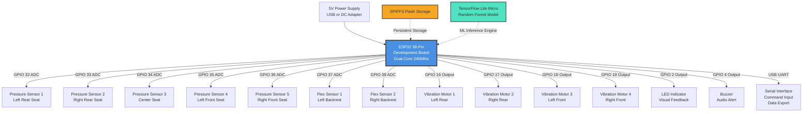
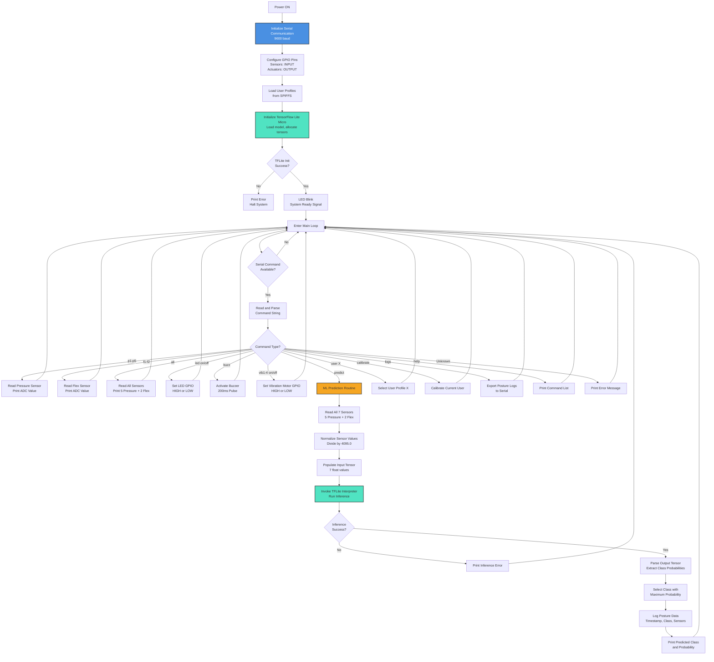

# Smart Chair Posture Monitoring System

A real-time embedded system for intelligent sitting posture detection and monitoring using ESP32, machine learning, and multimodal sensor fusion to promote ergonomic health and prevent musculoskeletal disorders.

[](https://opensource.org/licenses/MIT)
[](https://github.com/qppd/smart-chair/stargazers)
[](https://github.com/qppd/smart-chair/network)
[](https://github.com/qppd/smart-chair/issues)

---

## Table of Contents

1. [Problem Statement and Motivation](#problem-statement-and-motivation)
2. [System Overview](#system-overview)
3. [Key Features](#key-features)
4. [Hardware Architecture](#hardware-architecture)
   - [Component Specifications](#component-specifications)
   - [Pin Mapping Table](#pin-mapping-table)
   - [Power Requirements](#power-requirements)
5. [Wiring Overview](#wiring-overview)
6. [Software Architecture](#software-architecture)
   - [Firmware Overview](#firmware-overview)
   - [Data Structures](#data-structures)
   - [File Structure](#file-structure)
7. [Machine Learning Pipeline](#machine-learning-pipeline)
   - [Sensor Data Preparation](#sensor-data-preparation)
   - [Model Training Workflow](#model-training-workflow)
   - [TensorFlow Lite Micro Integration](#tensorflow-lite-micro-integration)
8. [System Flow](#system-flow)
9. [Serial Command Interface](#serial-command-interface)
10. [Calibration and User Profiles](#calibration-and-user-profiles)
11. [Data Logging and Export](#data-logging-and-export)
12. [Performance and Resource Usage](#performance-and-resource-usage)
13. [Limitations](#limitations)
14. [Future Improvements](#future-improvements)
15. [Installation and Setup](#installation-and-setup)
    - [Hardware Assembly](#hardware-assembly)
    - [Arduino IDE Setup](#arduino-ide-setup)
    - [ESP32 Configuration](#esp32-configuration)
16. [Project Structure](#project-structure)
17. [License](#license)
18. [Contributing Guidelines](#contributing-guidelines)
19. [Author and Credits](#author-and-credits)

---

## Problem Statement and Motivation

Prolonged sitting with poor posture is a pervasive issue in modern workplaces and home environments, contributing to a wide range of musculoskeletal disorders (MSDs), including chronic lower back pain, cervical spondylosis, spinal misalignment, and repetitive strain injuries. According to epidemiological studies, approximately 80% of adults experience back pain at some point in their lives, with poor sitting posture identified as a primary contributing factor.

The consequences of poor posture extend beyond physical discomfort:
- **Chronic pain**: Sustained pressure on spinal discs and misalignment of vertebrae lead to persistent pain.
- **Reduced productivity**: Pain and discomfort reduce cognitive performance and workplace efficiency.
- **Long-term disability**: Untreated postural issues can result in permanent structural damage requiring medical intervention.
- **Lack of awareness**: Most individuals are unaware of their sitting posture throughout the day, making correction difficult.

Existing commercial solutions are either prohibitively expensive, require invasive modifications to furniture, or rely on external cloud services that compromise user privacy. There is a clear need for an affordable, open-source, and privacy-respecting posture monitoring system that operates autonomously and provides real-time feedback.

This project addresses these challenges by developing an embedded system that:
- Monitors sitting posture in real-time using multimodal sensor fusion.
- Employs machine learning for accurate posture classification.
- Operates entirely offline without requiring internet connectivity.
- Provides multimodal feedback (haptic, visual, auditory) for immediate corrective action.
- Supports personalized calibration and multi-user profiles.
- Is open-source, extensible, and affordable.

---

## System Overview

The Smart Chair Posture Monitoring System is an embedded IoT device built on the ESP32 microcontroller platform. It integrates hardware sensors, embedded firmware, and machine learning to detect and classify sitting posture in real-time. The system operates autonomously without external connectivity, ensuring complete data privacy and low-latency response.

The system combines five pressure sensors distributed across the seat surface and two flex sensors mounted on the backrest to capture comprehensive postural information. These sensor inputs are processed by a TensorFlow Lite Micro Random Forest classifier, which predicts one of six posture classes. Based on the classification, the system can activate vibration motors for haptic feedback, illuminate an LED for visual indication, or sound a buzzer for auditory alerts.

All processing occurs locally on the ESP32, leveraging its dual-core architecture and sufficient SRAM for tensor operations. The firmware is written in Arduino C++ and includes modular components for sensor acquisition, machine learning inference, user profile management, calibration routines, and data logging.

This prototype is designed for research, education, and personal use, demonstrating how edge AI can be applied to health monitoring applications.

---

## Key Features

- **Real-Time Posture Monitoring**: Continuous acquisition and classification of sitting posture at user-defined intervals.
- **Machine Learning Classification**: TensorFlow Lite Micro Random Forest model for multi-class posture prediction with six distinct posture categories.
- **Multimodal Sensor Fusion**: Integration of five pressure sensors and two flex sensors for comprehensive posture assessment.
- **Personalized Calibration**: Per-user baseline calibration to account for individual body weight, size, and sitting preferences.
- **Multi-User Profiles**: Support for up to five user profiles with persistent storage via SPIFFS.
- **Haptic Feedback**: Four independently controllable vibration motors positioned strategically on the seat for targeted tactile feedback.
- **Visual and Auditory Alerts**: LED and buzzer actuators for immediate posture feedback.
- **Data Logging**: Timestamped posture event logging with support for up to 100 entries, exportable via serial interface.
- **Command-Based Testing Interface**: Interactive serial command system for debugging, sensor testing, and manual control of actuators.
- **Fully Offline Operation**: No internet connectivity required; all processing occurs locally on the ESP32.
- **Open Source**: MIT-licensed codebase for educational, research, and commercial applications.

---

## Hardware Architecture

### Component Specifications

The hardware architecture consists of a central ESP32 microcontroller interfacing with analog sensors and digital actuators. The components are selected for low cost, ease of integration, and compatibility with the ESP32 GPIO and ADC subsystems.

#### Microcontroller

**ESP32 38-Pin Development Board**
- **Processor**: Dual-core Xtensa LX6, up to 240 MHz
- **Memory**: 520 KB SRAM, 4 MB flash (typical)
- **ADC**: 12-bit resolution (0-4095), multiple ADC1 channels (GPIO 32-39)
- **GPIO**: 34 programmable GPIO pins (subset used for sensors and actuators)
- **Connectivity**: USB-to-UART for programming and serial communication
- **Power**: 5V DC via USB or external supply; onboard 3.3V regulator for logic
- **AI Capability**: Sufficient resources for TensorFlow Lite Micro inference

The ESP32 was selected for its balance of computational power, low cost, extensive GPIO support, and mature Arduino ecosystem.

#### Sensors

**5x Thin Film Pressure Sensors (FSR402 or similar)**
- **Type**: Force-sensitive resistor
- **Load Range**: 0.1 kg to 100 kg
- **Output**: Analog resistance varying with applied force
- **Interface**: Voltage divider circuit connected to ESP32 ADC
- **Placement**: Distributed across seat surface (left rear, right rear, center, left front, right front)
- **Purpose**: Measure weight distribution to detect leaning, slouching, and uneven sitting

**2x Flex Sensors (Spectra Symbol 4.5" or similar)**
- **Type**: Variable resistor, resistance increases with bending
- **Bend Range**: 0 to 90 degrees
- **Output**: Analog resistance
- **Interface**: Voltage divider circuit connected to ESP32 ADC
- **Placement**: Vertically mounted on left and right sides of backrest
- **Purpose**: Detect forward slouching, backward leaning, and lateral back curvature

**4x Vibration Motors (Coin-type DC motors)**
- **Type**: Eccentric rotating mass (ERM) vibration motor
- **Operating Voltage**: 3V - 5V DC
- **Current Draw**: ~50-100 mA per motor
- **Control**: Digital GPIO output (via transistor driver if necessary)
- **Placement**: Embedded in seat cushion near pressure sensor locations
- **Purpose**: Provide localized haptic feedback to guide user toward correct posture

#### Actuators

**1x LED Indicator**
- **Type**: Standard 5mm LED (red or multi-color)
- **Forward Voltage**: ~2V
- **Current Limiting**: 220-ohm series resistor
- **Control**: Digital GPIO output (GPIO 2)
- **Purpose**: Visual indication of posture status (on = poor posture, off = good posture)

**1x Buzzer**
- **Type**: Passive or active piezoelectric buzzer
- **Operating Voltage**: 3.3V - 5V
- **Control**: Digital GPIO output (GPIO 4)
- **Purpose**: Auditory alert for prolonged poor posture

#### Power Supply

- **Input**: 5V DC, 1A (minimum) via USB or external power adapter
- **Regulation**: Onboard 3.3V LDO regulator on ESP32 dev board
- **Current Consumption**:
  - ESP32 idle: ~80 mA
  - ESP32 active (dual-core): ~150-200 mA
  - Vibration motors (all on): ~400 mA
  - LED: ~20 mA
  - Buzzer: ~30 mA
  - **Total estimated maximum**: ~600 mA
- **Recommended Supply**: 5V, 1.5A power adapter for safe operation margin

---

### Pin Mapping Table

The following table provides the complete GPIO pin assignment for the ESP32 38-pin development board. Pin selection avoids GPIO 0, 1, 6-11 (flash interface), GPIO 12 (boot mode), and other pins with special boot behaviors.

| **Component**         | **ESP32 GPIO Pin** | **Pin Type**       | **Notes**                                      |
|-----------------------|--------------------|--------------------|------------------------------------------------|
| Pressure Sensor 1     | GPIO 32            | ADC1_CH4 (Input)   | Left rear seat position                        |
| Pressure Sensor 2     | GPIO 33            | ADC1_CH5 (Input)   | Right rear seat position                       |
| Pressure Sensor 3     | GPIO 34            | ADC1_CH6 (Input)   | Center seat position (input-only pin)          |
| Pressure Sensor 4     | GPIO 35            | ADC1_CH7 (Input)   | Left front seat position (input-only pin)      |
| Pressure Sensor 5     | GPIO 36 (SVP)      | ADC1_CH0 (Input)   | Right front seat position (input-only pin)     |
| Flex Sensor 1         | GPIO 37            | ADC1_CH1 (Input)   | Left backrest (input-only pin)                 |
| Flex Sensor 2         | GPIO 38            | ADC1_CH2 (Input)   | Right backrest (input-only pin)                |
| Vibration Motor 1     | GPIO 16            | Digital Output     | Left rear haptic feedback                      |
| Vibration Motor 2     | GPIO 17            | Digital Output     | Right rear haptic feedback                     |
| Vibration Motor 3     | GPIO 18            | Digital Output     | Left front haptic feedback                     |
| Vibration Motor 4     | GPIO 19            | Digital Output     | Right front haptic feedback                    |
| LED Indicator         | GPIO 2             | Digital Output     | Onboard LED (some boards), safe for output     |
| Buzzer                | GPIO 4             | Digital Output     | Audio alert                                    |

**Note**: GPIO 34-39 are input-only pins and cannot be used for output. They are ideal for analog sensor readings.

---

### Power Requirements

The system is designed to operate from a standard USB power source or an external 5V power adapter. The ESP32 development board includes an onboard voltage regulator that provides 3.3V logic levels for the microcontroller and GPIO peripherals.

**Power Budget Analysis**:
- **ESP32 Active (dual-core processing)**: ~150 mA
- **Sensor Circuits (passive voltage dividers)**: Negligible (~1-2 mA)
- **LED (continuous on)**: ~20 mA
- **Buzzer (active)**: ~30 mA
- **Single Vibration Motor (active)**: ~80 mA
- **Four Vibration Motors (all active)**: ~320 mA

**Worst-Case Total Current**: ~520 mA (all actuators active simultaneously)

A 5V, 1A power supply is sufficient for typical operation. A 1.5A supply is recommended for margin and future expansion.

---

## Wiring Overview

The wiring diagram and Fritzing schematic are provided in the `wiring/` directory:
- **Wiring.fzz**: Fritzing project file containing the complete circuit schematic and breadboard layout.
- **diagram/Wiring.png** (if exported): Visual reference for hardware assembly.

### Circuit Principles

#### Pressure and Flex Sensors (Analog Input)

Both pressure and flex sensors are variable resistors. They are interfaced to the ESP32 ADC using a simple voltage divider configuration:

```
VCC (3.3V)
    |
   [R_fixed] (10k ohm)
    |
    +---- GPIO (ADC input)
    |
   [Sensor] (variable resistance)
    |
   GND
```

As the sensor resistance changes, the voltage at the ADC input pin changes proportionally, producing analog readings in the range 0-4095 (12-bit ADC).

#### Vibration Motors (Digital Output)

Vibration motors are controlled via GPIO digital outputs. Since motor current (~80 mA each) exceeds safe GPIO current limits (~40 mA), transistor drivers (e.g., 2N2222 NPN transistor or MOSFET) should be used:

```
GPIO --> [Base Resistor (1k ohm)] --> Transistor Base
                                           |
                                      Collector -- Motor (+)
                                           |
                                        Emitter -- GND
Motor (-) --> VCC (5V)
```

Alternatively, for low-current motors, direct GPIO drive may be acceptable with appropriate current limiting.

#### LED and Buzzer (Digital Output)

Both are controlled directly via GPIO pins with current-limiting resistors for the LED and appropriate voltage/current for the buzzer.

---

### Hardware Block Diagram



---

## Software Architecture

### Firmware Overview

The firmware is developed in Arduino C++ using the Arduino IDE and ESP32 board support package. The code is structured as a single monolithic `.ino` file for simplicity, but follows modular functional organization.

**Core Responsibilities**:
1. **Sensor Acquisition**: Continuous polling of analog sensor inputs via ADC.
2. **Data Preprocessing**: Normalization of sensor readings to 0-1 range for ML model input.
3. **Machine Learning Inference**: Execution of TensorFlow Lite Micro model to classify posture.
4. **Actuator Control**: Activation of vibration motors, LED, and buzzer based on classification results or user commands.
5. **User Profile Management**: Loading and saving of user-specific calibration data via SPIFFS.
6. **Calibration Routine**: Interactive serial-driven calibration to establish per-user baseline posture.
7. **Data Logging**: Timestamped recording of posture events for retrospective analysis.
8. **Serial Command Interface**: Interactive command parser for testing, debugging, and manual control.

**Execution Model**:
- **Setup Phase**: Initialize GPIO pins, load user profiles from SPIFFS, initialize TensorFlow Lite Micro interpreter, allocate tensor arena.
- **Loop Phase**: Poll serial input for commands; execute command-specific actions (sensor reads, predictions, logging, actuator control).

---

### Data Structures

The firmware defines several key data structures to manage system state, user profiles, and logged data:

#### CalibrationData

Stores baseline sensor readings for a user in good posture and threshold parameters for deviation detection.

```cpp
struct CalibrationData {
  int pressureBaseline[5];  // Baseline ADC values for 5 pressure sensors
  int flexBaseline[2];      // Baseline ADC values for 2 flex sensors
  float pressureThreshold;  // Acceptable deviation from baseline (e.g., 0.2 = 20%)
  float flexThreshold;      // Acceptable deviation for flex sensors (e.g., 0.3 = 30%)
};
```

#### UserProfile

Encapsulates a named user and their associated calibration data.

```cpp
struct UserProfile {
  char name[20];           // User identifier (e.g., "User1")
  CalibrationData calib;   // User-specific calibration parameters
};
```

#### PostureLog

Represents a single logged posture event with timestamp, classification result, and raw sensor data.

```cpp
struct PostureLog {
  unsigned long timestamp;  // Milliseconds since boot (millis())
  int postureClass;         // Predicted posture class (0-5)
  int sensorData[7];        // Raw ADC readings: 5 pressure + 2 flex
};
```

**Global Arrays**:
- `UserProfile users[MAX_USERS]`: Array of up to 5 user profiles.
- `PostureLog logs[MAX_LOGS]`: Circular buffer for up to 100 posture events.
- `int currentUser`: Index of the active user profile (-1 if none selected).
- `int logIndex`: Current index in the circular log buffer.

---

### File Structure

The firmware is organized as a single Arduino sketch file with logical sections:

```
SmartChair.ino
├── Includes and Libraries
│   ├── TensorFlowLite_ESP32.h
│   ├── SPIFFS.h
│   └── EEPROM.h
├── Pin Definitions
│   ├── Pressure sensor pins (GPIO 32-36)
│   ├── Flex sensor pins (GPIO 37-38)
│   ├── Vibration motor pins (GPIO 16-19)
│   └── LED and buzzer pins (GPIO 2, 4)
├── Data Structures
│   ├── CalibrationData
│   ├── UserProfile
│   └── PostureLog
├── TensorFlow Lite Globals
│   ├── Model pointer
│   ├── Interpreter pointer
│   ├── Tensor arena allocation
│   └── Input/output tensor pointers
├── Utility Functions
│   ├── loadUserProfiles()
│   ├── saveUserProfiles()
│   ├── calibrateUser(userIndex)
│   ├── logPostureData(class, data)
│   └── exportLogs()
├── setup()
│   ├── Initialize serial communication
│   ├── Configure GPIO pin modes
│   ├── Load user profiles from SPIFFS
│   ├── Initialize TensorFlow Lite model
│   └── Signal ready (LED blink)
└── loop()
    ├── Poll serial input
    ├── Parse and execute commands
    ├── Sensor reading (p1-p5, f1-f2, all)
    ├── Actuator control (led, buzz, vib1-vib4)
    ├── ML prediction (predict)
    ├── User management (user, calibrate)
    └── Data export (logs)
```

---

## Machine Learning Pipeline

### Sensor Data Preparation

**Raw Data Acquisition**:
- Each sensor produces a 12-bit ADC value in the range 0-4095.
- Five pressure sensors measure force distribution across the seat.
- Two flex sensors measure backrest curvature.

**Feature Vector**:
- The ML model expects a 7-dimensional input feature vector: `[P1, P2, P3, P4, P5, F1, F2]`.
- Each feature is normalized to the range [0, 1] by dividing by 4095.0.

**Normalization Formula**:
```
normalized_value = raw_ADC_value / 4095.0
```

This ensures consistent input scaling for the machine learning model and improves numerical stability during inference.

**Data Collection for Training**:
1. User sits in each of the six posture positions (good, slouch, lean left, lean right, lean forward, lean backward).
2. For each posture, collect 50-100 samples at 1-second intervals via the `all` serial command.
3. Label each sample with the corresponding posture class (0-5).
4. Export data using the `logs` command and save to CSV format for offline training.

---

### Model Training Workflow

The machine learning model is trained offline on a development machine (not on the ESP32) using TensorFlow and scikit-learn. The Random Forest classifier is chosen for its robustness, interpretability, and compatibility with TensorFlow Lite.

**Training Steps**:

1. **Data Collection**: Gather labeled training data (minimum 300 samples, 50 per class) using the Smart Chair hardware and serial interface.

2. **Data Preprocessing**: Load CSV data, extract feature matrix `X` (7 columns: pressure and flex values) and label vector `y` (posture class 0-5).

3. **Model Training**: Train a Random Forest classifier using scikit-learn:
   ```python
   from sklearn.ensemble import RandomForestClassifier
   clf = RandomForestClassifier(n_estimators=50, max_depth=5, random_state=42)
   clf.fit(X_train, y_train)
   ```

4. **Model Evaluation**: Validate model accuracy on a held-out test set. Target accuracy: >85%.

5. **Conversion to TensorFlow**: Convert the scikit-learn model to a TensorFlow-compatible format using libraries such as `sklearn-porter` or `hummingbird-ml`, then save as a TensorFlow SavedModel.

6. **TensorFlow Lite Conversion**: Convert the TensorFlow model to TensorFlow Lite format with optimization:
   ```python
   import tensorflow as tf
   converter = tf.lite.TFLiteConverter.from_saved_model('model_dir')
   converter.optimizations = [tf.lite.Optimize.DEFAULT]
   tflite_model = converter.convert()
   with open('model.tflite', 'wb') as f:
       f.write(tflite_model)
   ```

7. **Model Quantization**: Optionally quantize to 8-bit integers for reduced memory footprint.

8. **Model Serialization**: Convert the `.tflite` binary file to a C byte array for embedding in firmware:
   ```bash
   xxd -i model.tflite > model.h
   ```

---

### TensorFlow Lite Micro Integration

**Embedding the Model**:
- The trained `.tflite` model is converted to a C byte array and embedded directly in the firmware as `model_tflite[]`.
- The byte array is stored in program memory (flash) and loaded at runtime.

**TensorFlow Lite Micro Initialization**:
1. **Model Loading**: Parse the flatbuffer-encoded model using `tflite::GetModel(model_tflite)`.
2. **Schema Version Check**: Verify compatibility with TFLite schema version.
3. **Operation Resolver**: Register required operations (e.g., `FullyConnected`, `Softmax`) using `MicroMutableOpResolver`.
4. **Interpreter Creation**: Instantiate a `MicroInterpreter` with the model, resolver, and a pre-allocated tensor arena (8 KB).
5. **Tensor Allocation**: Allocate input and output tensors in the arena using `interpreter->AllocateTensors()`.
6. **Tensor Pointers**: Obtain pointers to input and output tensors for data transfer.

**Inference Execution**:
1. **Input Preparation**: Populate input tensor with normalized sensor values:
   ```cpp
   input->data.f[0] = pressure1 / 4095.0f;
   input->data.f[1] = pressure2 / 4095.0f;
   // ... (repeat for all 7 features)
   ```
2. **Invoke Model**: Execute inference using `interpreter->Invoke()`.
3. **Output Parsing**: Extract class probabilities from output tensor and select the class with maximum probability:
   ```cpp
   int predictedClass = 0;
   float maxProb = output->data.f[0];
   for (int i = 1; i < numClasses; i++) {
       if (output->data.f[i] > maxProb) {
           maxProb = output->data.f[i];
           predictedClass = i;
       }
   }
   ```
4. **Result Logging**: Log the predicted class and timestamp to the `PostureLog` array.

**Memory Management**:
- The tensor arena is a statically allocated buffer (`uint8_t tensor_arena[8192]`) used for intermediate tensor storage during inference.
- Arena size is tuned based on model complexity; insufficient size causes `AllocateTensors()` to fail.

---

## System Flow

The following Mermaid flowchart illustrates the complete system operation from initialization through posture classification and feedback.



---

## Serial Command Interface

The system provides an interactive command-line interface over the serial connection (9600 baud, 8N1) for debugging, testing, and manual control. Commands are sent as plain text strings terminated by newline (`\n`).

### Command Reference Table

| **Command**       | **Description**                                                                 | **Example Output**                          |
|-------------------|---------------------------------------------------------------------------------|---------------------------------------------|
| `p1`              | Read and print Pressure Sensor 1 ADC value.                                     | `Pressure Sensor 1: 2345`                   |
| `p2`              | Read and print Pressure Sensor 2 ADC value.                                     | `Pressure Sensor 2: 1876`                   |
| `p3`              | Read and print Pressure Sensor 3 ADC value.                                     | `Pressure Sensor 3: 3021`                   |
| `p4`              | Read and print Pressure Sensor 4 ADC value.                                     | `Pressure Sensor 4: 1654`                   |
| `p5`              | Read and print Pressure Sensor 5 ADC value.                                     | `Pressure Sensor 5: 2987`                   |
| `f1`              | Read and print Flex Sensor 1 ADC value.                                         | `Flex Sensor 1: 1234`                       |
| `f2`              | Read and print Flex Sensor 2 ADC value.                                         | `Flex Sensor 2: 1456`                       |
| `all`             | Read and print all sensor values (5 pressure + 2 flex).                         | `Pressure: 2345, 1876, ...\nFlex: 1234, 1456` |
| `led on`          | Turn LED indicator on (GPIO 2 HIGH).                                            | `LED turned ON`                             |
| `led off`         | Turn LED indicator off (GPIO 2 LOW).                                            | `LED turned OFF`                            |
| `buzz`            | Activate buzzer for 200ms.                                                      | `Buzzer beeped`                             |
| `vib1 on`         | Turn Vibration Motor 1 on (GPIO 16 HIGH).                                       | `Vibration Motor 1: ON`                     |
| `vib1 off`        | Turn Vibration Motor 1 off (GPIO 16 LOW).                                       | `Vibration Motor 1: OFF`                    |
| `vib2 on`         | Turn Vibration Motor 2 on (GPIO 17 HIGH).                                       | `Vibration Motor 2: ON`                     |
| `vib2 off`        | Turn Vibration Motor 2 off (GPIO 17 LOW).                                       | `Vibration Motor 2: OFF`                    |
| `vib3 on`         | Turn Vibration Motor 3 on (GPIO 18 HIGH).                                       | `Vibration Motor 3: ON`                     |
| `vib3 off`        | Turn Vibration Motor 3 off (GPIO 18 LOW).                                       | `Vibration Motor 3: OFF`                    |
| `vib4 on`         | Turn Vibration Motor 4 on (GPIO 19 HIGH).                                       | `Vibration Motor 4: ON`                     |
| `vib4 off`        | Turn Vibration Motor 4 off (GPIO 19 LOW).                                       | `Vibration Motor 4: OFF`                    |
| `vib all on`      | Turn all vibration motors on simultaneously.                                    | `All Vibration Motors: ON`                  |
| `vib all off`     | Turn all vibration motors off simultaneously.                                   | `All Vibration Motors: OFF`                 |
| `predict`         | Acquire sensor data, run ML inference, log result, and print predicted posture. | `ML Prediction - Class: 2 (Probability: 0.89) - Logged` |
| `user X`          | Select user profile X (0-4) as the active user.                                 | `Selected user: 2`                          |
| `calibrate`       | Start calibration routine for the current user (requires `user X` first).       | `Starting calibration...`                   |
| `calib done`      | Complete calibration and save baseline values (used during calibration).        | `Calibration complete`                      |
| `logs`            | Export all logged posture events to serial in CSV format.                       | `Time: 12345, Class: 0, Data: 2345,1876,...` |
| `help`            | Print list of all available commands.                                           | `Available commands: p1-p5, f1-f2, ...`     |

---

## Calibration and User Profiles

Calibration is essential for personalizing the system to individual users, accounting for differences in body weight, size, and preferred sitting position. Each user establishes a baseline "good posture" profile against which deviations are measured.

### Calibration Process

1. **Select User**: Issue the `user X` command (X = 0-4) to select a user profile slot.
2. **Initiate Calibration**: Issue the `calibrate` command. The system prompts the user to sit in their optimal posture.
3. **User Positioning**: The user adjusts their seating position to achieve correct ergonomic posture (back supported, weight evenly distributed, spine aligned).
4. **Confirm Calibration**: User sends the `calib done` command via serial.
5. **Baseline Capture**: The system reads all sensor values and stores them in the `CalibrationData` structure for the selected user.
6. **Threshold Calculation**: Deviation thresholds are set (e.g., 20% for pressure sensors, 30% for flex sensors).
7. **Persistent Storage**: Calibration data is saved to SPIFFS (`/profiles.dat`) and persists across power cycles.

### User Profile Management

Up to five user profiles are supported, enabling shared use of the chair in multi-user environments (e.g., office workstations, laboratory setups).

**Profile Storage**:
- User profiles are stored as a binary array in SPIFFS flash memory.
- On boot, profiles are loaded from `/profiles.dat` (if present).
- Profiles are saved after each calibration using the `saveUserProfiles()` function.

**Multi-User Workflow**:
1. User A selects their profile: `user 0`.
2. System loads User A's calibration data.
3. ML predictions are contextualized to User A's baseline.
4. When User B arrives, they switch profiles: `user 1`.
5. System loads User B's calibration data for personalized monitoring.

---

## Data Logging and Export

The system maintains an in-memory circular buffer of up to 100 posture events. Each event records:
- **Timestamp**: Milliseconds since boot (`millis()`).
- **Posture Class**: Predicted class (0-5).
- **Sensor Data**: Raw ADC values for all 7 sensors.

### Logging Mechanism

- After each ML prediction (`predict` command), the result is logged using `logPostureData()`.
- The log buffer is circular: when full, the oldest entry is overwritten.
- Logs are stored in RAM and are lost on power cycle (non-persistent).

### Data Export

- **Command**: `logs`
- **Format**: Plain text, one line per log entry.
- **Fields**: `Time: <timestamp>, Class: <class>, Data: <sensor1>,<sensor2>,...,<sensor7>`
- **Use Case**: Export data via serial terminal, copy-paste into CSV file for offline analysis, visualization, or additional ML training.

Example output:
```
Posture Logs:
Time: 12345, Class: 0, Data: 2345,1876,3021,1654,2987,1234,1456
Time: 15678, Class: 2, Data: 2100,2200,3100,1500,2800,1300,1500
...
```

---

## Performance and Resource Usage

### Computational Performance

- **ADC Read Time**: ~10 microseconds per channel (hardware ADC).
- **ML Inference Time**: Depends on model complexity; typical Random Forest with 50 trees and max depth 5: ~20-50 ms per prediction on ESP32.
- **Serial I/O**: Minimal overhead; command parsing is string-based and infrequent.
- **Total Prediction Latency**: ~50-100 ms from sensor read to classification output.

### Memory Usage

- **Flash (Program Memory)**:
  - Firmware code: ~50-100 KB (depends on TFLite library size).
  - TFLite model: ~10-50 KB (depends on model size and quantization).
  - Total estimated: ~100-200 KB (well within ESP32's 4 MB flash).

- **SRAM (Runtime Memory)**:
  - Global variables (sensor arrays, user profiles, logs): ~10 KB.
  - TFLite tensor arena: 8 KB (tunable).
  - Stack and heap: ~50-100 KB.
  - Total estimated: ~70-120 KB (well within ESP32's 520 KB SRAM).

- **SPIFFS (File System)**:
  - User profiles: ~500 bytes per user, ~2.5 KB total for 5 users.
  - Overhead: ~10-20 KB for filesystem metadata.

### Real-Time Constraints

The system is **soft real-time**: posture classification does not have strict timing deadlines, but responsiveness is desirable for user experience. Inference times of 50-100 ms are acceptable for posture monitoring (human posture changes occur on the timescale of seconds).

---

## Limitations

1. **Prototype Status**: This is a research and development prototype. It has not undergone clinical validation or user studies.
2. **Model Accuracy**: Posture classification accuracy depends on training data quality and diversity. Overfitting to a single user or environment is possible.
3. **Sensor Placement Sensitivity**: System performance is sensitive to sensor positioning. Incorrect placement reduces classification accuracy.
4. **Single-User Calibration at a Time**: Only one user profile is active; switching requires manual `user X` command.
5. **Non-Persistent Logs**: Posture logs are stored in RAM and lost on power cycle. SPIFFS logging is not implemented.
6. **No Wireless Connectivity**: The system does not support Wi-Fi or Bluetooth for remote monitoring or data export.
7. **Manual Model Update**: Replacing the ML model requires recompiling and re-flashing the firmware.
8. **Limited Actuator Intelligence**: Feedback is manual (triggered by user commands) or must be scripted; no automatic feedback loop based on posture class is implemented in this version.
9. **Power Consumption**: Continuous operation with all motors active (~600 mA) may not be suitable for battery-powered deployments.

---

## Future Improvements

1. **Automatic Feedback Loop**: Implement autonomous posture monitoring with automatic vibration motor activation when poor posture is detected (e.g., activate motor corresponding to pressure deficit region).
2. **Persistent Data Logging**: Store logs to SPIFFS or SD card for long-term analysis and export.
3. **Wireless Data Export**: Add Wi-Fi or Bluetooth support for wireless log download and remote monitoring via mobile app or web interface.
4. **Real-Time Clock (RTC)**: Integrate RTC module for absolute timestamps rather than relative `millis()` values.
5. **Graphical User Interface**: Develop a companion web dashboard or mobile app for configuration, real-time monitoring, and data visualization.
6. **Expanded User Profiles**: Increase user capacity and add profile metadata (user name, weight, height).
7. **Adaptive Calibration**: Implement automatic recalibration or drift correction based on long-term usage patterns.
8. **Additional Sensors**: Integrate IMU (accelerometer/gyroscope) for detecting chair tilt or user motion.
9. **Clinical Validation**: Conduct user studies with controlled experiments to validate classification accuracy against ground-truth posture assessments.
10. **Energy Efficiency**: Implement sleep modes and low-power optimizations for battery-powered operation.
11. **Over-the-Air (OTA) Updates**: Enable remote firmware and model updates via Wi-Fi.
12. **Model Retraining Interface**: Develop tooling for easy model retraining and deployment without manual byte array conversion.

---

## Installation and Setup

### Hardware Assembly

1. **Procure Components**:
   - ESP32 38-pin development board (e.g., ESP32-DevKitC)
   - 5x thin film pressure sensors (FSR402 or equivalent)
   - 2x flex sensors (4.5" or similar)
   - 4x vibration motors (coin-type ERM)
   - 1x LED (5mm, red or multi-color)
   - 1x buzzer (passive or active)
   - Resistors: 10k ohm (for voltage dividers), 220 ohm (for LED), 1k ohm (for transistor bases)
   - Transistors: 2N2222 NPN or equivalent (for motor drivers)
   - Breadboard and jumper wires
   - 5V DC power supply (1.5A recommended)

2. **Wire Voltage Dividers for Sensors**:
   - For each pressure and flex sensor, create a voltage divider:
     - Connect one end of a 10k resistor to 3.3V.
     - Connect the other end of the resistor to the sensor and to the ESP32 ADC pin (GPIO 32-38 as per pin table).
     - Connect the other end of the sensor to GND.

3. **Wire Vibration Motors**:
   - Connect each motor to a transistor driver circuit (base resistor from GPIO, collector to motor, emitter to GND).
   - Connect motor power wire to 5V supply.

4. **Wire LED and Buzzer**:
   - LED: Connect anode to GPIO 2 via 220-ohm resistor, cathode to GND.
   - Buzzer: Connect positive terminal to GPIO 4, negative to GND.

5. **Power Connections**:
   - Connect 5V and GND from power supply to breadboard power rails.
   - Connect ESP32 VIN to 5V and GND to GND (if using external supply).

6. **Sensor Placement**:
   - Pressure sensors: Distribute evenly across seat cushion (left rear, right rear, center, left front, right front).
   - Flex sensors: Mount vertically on backrest (left and right sides).
   - Vibration motors: Embed in seat cushion near pressure sensors.

7. **Secure Connections**:
   - Use solder or screw terminals for permanent connections.
   - For prototyping, breadboard with jumper wires is acceptable.

**Reference**: See [wiring/Wiring.fzz](wiring/Wiring.fzz) for detailed circuit schematic.

---

### Arduino IDE Setup

1. **Install Arduino IDE**:
   - Download from [https://www.arduino.cc/en/software](https://www.arduino.cc/en/software).
   - Install version 1.8.x or 2.x.

2. **Install ESP32 Board Support**:
   - Open Arduino IDE.
   - Go to `File > Preferences`.
   - In "Additional Board Manager URLs", add:
     ```
     https://raw.githubusercontent.com/espressif/arduino-esp32/gh-pages/package_esp32_index.json
     ```
   - Click OK.
   - Go to `Tools > Board > Boards Manager`.
   - Search for "esp32" and install "esp32 by Espressif Systems" (version 2.0.x or later recommended).

3. **Install TensorFlow Lite for Microcontrollers**:
   - Go to `Sketch > Include Library > Manage Libraries`.
   - Search for "TensorFlowLite_ESP32" or "TensorFlow Lite Micro".
   - Install the library compatible with ESP32 (e.g., `EloquentTinyML` or official `TensorFlowLite` library).

4. **Install SPIFFS Library**:
   - SPIFFS is included with ESP32 core; no separate installation needed.

---

### ESP32 Configuration

1. **Open Smart Chair Sketch**:
   - Navigate to `source/SmartChair/SmartChair.ino` and open in Arduino IDE.

2. **Select Board**:
   - Go to `Tools > Board > ESP32 Arduino`.
   - Select "ESP32 Dev Module" or specific board model (e.g., "ESP32-DevKitC").

3. **Select Port**:
   - Connect ESP32 to computer via USB.
   - Go to `Tools > Port` and select the COM port (Windows) or `/dev/ttyUSB*` (Linux/Mac).

4. **Configure Upload Settings**:
   - `Tools > Upload Speed`: 115200 (default) or 921600 (faster).
   - `Tools > Flash Frequency`: 80 MHz (default).
   - `Tools > Partition Scheme`: Default 4MB with SPIFFS (or "Default" with at least 1MB SPIFFS).

5. **Embed TensorFlow Lite Model**:
   - **Important**: Replace the placeholder `model_tflite[]` array in the sketch with your trained model.
   - Convert `.tflite` file to C array:
     ```bash
     xxd -i model.tflite > model.h
     ```
   - Copy the byte array from `model.h` into the firmware, replacing the placeholder.

6. **Upload Firmware**:
   - Click the "Upload" button (right arrow icon) in Arduino IDE.
   - Wait for compilation and upload to complete.
   - Monitor serial output at 9600 baud: `Tools > Serial Monitor`.

7. **Verify Operation**:
   - After upload, the LED should blink once, indicating system ready.
   - Type `help` in the serial monitor to see available commands.
   - Test sensors: `all`, `p1`, `f1`, etc.
   - Test prediction: `predict`.

---

## Project Structure

```
smart-chair/
├── LICENSE                      # MIT License file
├── README.md                    # This file
├── diagram/                     # System diagrams and schematics
│   └── (Wiring diagrams, images, etc.)
├── source/                      # Source code
│   └── SmartChair/              # Arduino sketch folder
│       └── SmartChair.ino       # Main firmware file (ESP32 Arduino C++)
└── wiring/                      # Wiring and circuit design files
    └── Wiring.fzz               # Fritzing project file with circuit schematic
```

---

## License

This project is licensed under the **MIT License**.

```
MIT License

Copyright (c) 2025 Sajed Lopez Mendoza (qppd)

Permission is hereby granted, free of charge, to any person obtaining a copy
of this software and associated documentation files (the "Software"), to deal
in the Software without restriction, including without limitation the rights
to use, copy, modify, merge, publish, distribute, sublicense, and/or sell
copies of the Software, and to permit persons to whom the Software is
furnished to do so, subject to the following conditions:

The above copyright notice and this permission notice shall be included in all
copies or substantial portions of the Software.

THE SOFTWARE IS PROVIDED "AS IS", WITHOUT WARRANTY OF ANY KIND, EXPRESS OR
IMPLIED, INCLUDING BUT NOT LIMITED TO THE WARRANTIES OF MERCHANTABILITY,
FITNESS FOR A PARTICULAR PURPOSE AND NONINFRINGEMENT. IN NO EVENT SHALL THE
AUTHORS OR COPYRIGHT HOLDERS BE LIABLE FOR ANY CLAIM, DAMAGES OR OTHER
LIABILITY, WHETHER IN AN ACTION OF CONTRACT, TORT OR OTHERWISE, ARISING FROM,
OUT OF OR IN CONNECTION WITH THE SOFTWARE OR THE USE OR OTHER DEALINGS IN THE
SOFTWARE.
```

See [LICENSE](LICENSE) for full text.

---

## Contributing Guidelines

Contributions are welcome and encouraged. This project benefits from community involvement in hardware testing, machine learning improvements, documentation, and feature development.

### How to Contribute

1. **Fork the Repository**: Click the "Fork" button on the GitHub repository page.
2. **Clone Your Fork**: `git clone https://github.com/your-username/smart-chair.git`
3. **Create a Feature Branch**: `git checkout -b feature/your-feature-name`
4. **Make Changes**: Implement your feature, bug fix, or documentation improvement.
5. **Test Thoroughly**: Ensure your changes work as expected and do not break existing functionality.
6. **Commit with Descriptive Messages**: `git commit -m "Add feature: real-time posture alerts"`
7. **Push to Your Fork**: `git push origin feature/your-feature-name`
8. **Open a Pull Request**: Submit a PR to the main repository with a clear description of your changes.

### Contribution Areas

- **Hardware**: Improved sensor mounting designs, alternative sensor recommendations, PCB layout.
- **Firmware**: Code optimization, bug fixes, new features (e.g., automatic feedback, Wi-Fi support).
- **Machine Learning**: Model architecture improvements, hyperparameter tuning, expanded training datasets.
- **Documentation**: Tutorials, user guides, video demonstrations, translation.
- **Testing**: User studies, accuracy benchmarking, cross-platform testing.

### Code Style

- Follow Arduino C++ conventions.
- Use descriptive variable and function names.
- Comment complex logic and algorithms.
- Maintain modular structure.

### Reporting Issues

If you encounter bugs or have feature requests:
- Open an issue on GitHub: [https://github.com/qppd/smart-chair/issues](https://github.com/qppd/smart-chair/issues)
- Provide detailed descriptions, error messages, and steps to reproduce.

---

## Author and Credits

**Author**: Sajed Lopez Mendoza (qppd)  
**GitHub**: [https://github.com/qppd](https://github.com/qppd)  
**Repository**: [https://github.com/qppd/smart-chair](https://github.com/qppd/smart-chair)  
**Project Year**: 2025

### Acknowledgments

- **TensorFlow Lite for Microcontrollers**: Google TensorFlow team for enabling on-device machine learning.
- **ESP32 Community**: Espressif Systems and the Arduino-ESP32 community for robust hardware and software support.
- **Open Source Libraries**: Contributors to SPIFFS, Arduino, and embedded systems libraries.
- **Academic Research**: Studies on ergonomics and posture monitoring that inform the design of this system.

This project is built entirely with open-source tools and is released freely to support education, research, and innovation in embedded systems and health technology.

---

**For questions, support, or collaboration inquiries, please open an issue on the GitHub repository or contact the author directly through GitHub.**
    
    I -->|p1-p5| J[Read Pressure Sensor]
    I -->|f1-f2| L[Read Flex Sensor]
    I -->|vib1 on/off| V1[Control Vibration Motor 1]
    I -->|vib2 on/off| V2[Control Vibration Motor 2]
    I -->|vib3 on/off| V3[Control Vibration Motor 3]
    I -->|vib4 on/off| V4[Control Vibration Motor 4]
    I -->|vib all on/off| VA[Control All Vibration Motors]
    I -->|led on/off| M[Control LED]
    I -->|buzz| N[Activate Buzzer]
    I -->|all| O[Read All Sensors]
    I -->|predict| PP[Run ML Inference]
    I -->|help| P[Display Help Menu]
    
    J --> Q[Send Reading to Serial]
    L --> Q
    V1 --> Q
    V2 --> Q
    V3 --> Q
    V4 --> Q
    VA --> Q
    M --> Q
    N --> Q
    O --> R[Process All Sensor Data]
    PP --> QQ[Output Prediction]
    P --> Q
    
    R --> S[Display Sensor Readings]
    
    S --> Q
    
    QQ --> Q
    
    Q --> G
```

## System Operation

The firmware is written in Arduino C++ for the ESP32 platform. The main program structure consists of:

### Setup Function
- Initialize serial communication at 9600 baud
- Configure all sensor pins as INPUT
- Configure all actuator pins as OUTPUT
- Perform initial LED blink to indicate system readiness

### Loop Function
The system operates in command-driven mode for testing and debugging:
- Wait for serial input commands
- Parse received command string
- Execute corresponding action based on command
- Return sensor readings or status to serial monitor

### Available Commands
- `p1` to `p5`: Read individual pressure sensors
- `f1` to `f2`: Read individual flex sensors
- `vib1 on` / `vib1 off`: Control vibration motor 1
- `vib2 on` / `vib2 off`: Control vibration motor 2
- `vib3 on` / `vib3 off`: Control vibration motor 3
- `vib4 on` / `vib4 off`: Control vibration motor 4
- `vib all on` / `vib all off`: Control all vibration motors
- `led on` / `led off`: Control LED state
- `buzz`: Test buzzer
- `all`: Read all sensors simultaneously
- `help`: Display command list

This command-based approach allows for component-level testing and validation during development and deployment.

## Machine Learning Integration

The system includes TensorFlow Lite for Microcontrollers to run a Random Forest model for posture classification. This provides more sophisticated posture detection compared to simple threshold-based logic.

### Model Training
1. Collect sensor data from multiple users in various posture positions
2. Label the data with appropriate posture classes:
   - **0 = Good Posture**: Proper upright sitting with even weight distribution
   - **1 = Slouching**: Forward leaning with rounded back (flex sensors detect curvature)
   - **2 = Leaning Left**: Weight shifted to left side (pressure sensors show imbalance)
   - **3 = Leaning Right**: Weight shifted to right side (pressure sensors show imbalance)
   - **4 = Leaning Forward**: Too far forward on seat (pressure distribution indicates forward shift)
   - **5 = Leaning Backward**: Too far back on seat (pressure distribution indicates backward shift)
3. Train a Random Forest classifier using scikit-learn in Python
4. Convert the trained model to TensorFlow Lite format (.tflite)
5. Embed the model bytes into the ESP32 firmware

### Data Collection Methodology
- **Participants**: Collect data from 5-10 users of different body types and sizes
- **Positions per User**: 20-30 samples per posture class (100-200 total samples per user)
- **Sensor Calibration**: Each user performs baseline calibration first
- **Data Capture**: Use serial commands (`all` command) to collect raw sensor readings
- **Labeling**: Manually label each captured sample based on observed posture
- **Validation**: Cross-validate labels by having multiple observers confirm posture classes

### Model Output
- Multi-class classification with probabilities for each posture type
- Classes:
  - **0 = Good Posture**: Proper sitting position
  - **1 = Slouching**: Excessive forward bending detected by flex sensors
  - **2 = Leaning Left**: Uneven pressure distribution favoring left side
  - **3 = Leaning Right**: Uneven pressure distribution favoring right side
  - **4 = Leaning Forward**: Pressure concentrated toward front of seat
  - **5 = Leaning Backward**: Pressure concentrated toward back of seat
- System selects the class with highest probability

### Model Performance Expectations
- **Accuracy Target**: 85-95% classification accuracy across all posture classes
- **Real-time Inference**: <100ms processing time on ESP32
- **Memory Usage**: <50KB for model storage and inference
- **Cross-validation**: Use 80/20 train/test split with stratified sampling

### Firmware Commands
- `predict`: Runs ML inference on current sensor readings and logs the predicted posture class
- `user X`: Select user profile (0-4) for personalized calibration
- `calibrate`: Calibrate sensors for current user (sit in good posture)
- `logs`: Export historical posture data for analysis

### User Profiles and Calibration
- Supports up to 5 user profiles stored in ESP32 SPIFFS
- Each profile includes personalized baseline readings for reference
- Calibration process: User sits in correct posture, system records baseline values
- Baseline data stored for user identification and logging purposes

### Data Logging
- Stores last 100 posture predictions with timestamps and sensor data
- Data can be exported via serial for trend analysis
- Enables monitoring posture improvement over time

### Model Replacement
To update the model:
1. Train a new Random Forest model with multi-class labels
2. Convert to .tflite using TensorFlow tools
3. Replace the `model_tflite` array in the code with new model bytes
4. Update `model_tflite_len` with the new length
5. Recompile and upload to ESP32

## Pin Assignments

| Component | GPIO Pin | Type | Notes |
|-----------|----------|------|-------|
| Pressure Sensor 1 | 32 | Analog Input | ADC1 |
| Pressure Sensor 2 | 33 | Analog Input | ADC1 |
| Pressure Sensor 3 | 34 | Analog Input | ADC1, Input-only |
| Pressure Sensor 4 | 35 | Analog Input | ADC1, Input-only |
| Pressure Sensor 5 | 36 | Analog Input | ADC1, Input-only |
| Vibration Motor 1 | 16 | Digital Output | Safe GPIO |
| Vibration Motor 2 | 17 | Digital Output | Safe GPIO |
| Vibration Motor 3 | 18 | Digital Output | Safe GPIO |
| Vibration Motor 4 | 19 | Digital Output | Safe GPIO |
| Flex Sensor 1 | 37 | Analog Input | ADC1, Input-only |
| Flex Sensor 2 | 38 | Analog Input | ADC1, Input-only |
| LED Indicator | 2 | Digital Output | Built-in LED compatible |
| Buzzer | 4 | Digital Output | PWM capable |

All pin assignments avoid conflicts with ESP32 boot pins, flash pins, and WiFi operation.

## Setup and Operation

### Hardware Assembly
1. Mount 5 pressure sensors on chair seat in grid pattern (corners + center)
2. Attach 2 flex sensors vertically on chair backrest (left and right side)
3. Place 4 vibration motors near pressure sensors on seat
4. Connect all sensor outputs to designated ESP32 GPIO pins
5. Connect LED and buzzer to designated output pins
6. Provide 5V power to ESP32 via USB or DC adapter

### Software Installation
1. Install Arduino IDE version 1.8.0 or newer
2. Add ESP32 board support via Board Manager (install "esp32" by Espressif Systems)
3. Clone repository: `git clone https://github.com/qppd/smart-chair.git`
4. Open `source/SmartChair/SmartChair.ino` in Arduino IDE
5. Select board: Tools > Board > ESP32 Dev Module
6. Select correct COM port
7. Upload firmware to ESP32

### Operation
1. Power on the ESP32
2. System initializes and LED blinks once
3. Open Serial Monitor at 9600 baud
4. Use serial commands to test individual components
5. Observe sensor readings and actuator responses
6. Verify ML posture prediction by simulating different sitting positions

## Wiring Diagram

Refer to the wiring directory for detailed circuit diagrams:
- `wiring/Wiring.fzz` - Editable Fritzing source file
- `wiring/Wiring.png` - Static circuit diagram image

## Project Structure

```
smart-chair/
├── source/
│   └── SmartChair/
│       └── SmartChair.ino          # Main ESP32 firmware
├── wiring/
│   ├── Wiring.fzz                  # Fritzing circuit design
│   └── Wiring.png                  # Circuit diagram image
├── diagram/                        # Additional system diagrams
├── LICENSE                         # MIT License
└── README.md                       # This documentation
```

## Limitations

1. **Calibration Dependency**: Users must perform initial calibration for personalized baseline readings
2. **Limited User Profiles**: Maximum of 5 user profiles supported due to ESP32 storage constraints
3. **Model Accuracy**: ML model performance depends on quality and quantity of training data
4. **Storage Capacity**: Posture logs limited to last 100 entries due to RAM constraints
5. **Real-time Processing**: ML inference adds minor latency compared to threshold-based detection
6. **Power Consumption**: Continuous sensor monitoring and ML processing increases battery drain
7. **Sensor Durability**: Pressure and flex sensors may require periodic recalibration due to wear
8. **Environmental Factors**: Temperature and humidity can affect sensor readings accuracy
9. **Training Data Requirements**: Multi-class posture classification requires diverse labeled training dataset
10. **Model Updates**: Over-the-air model updates not supported; requires firmware recompilation

## Future Development Path

The system now includes TensorFlow Lite for Microcontrollers with Random Forest models for posture classification. Future enhancements could include:

- Over-the-air model updates via WiFi
- Expanded user profile storage with external EEPROM
- Integration with mobile apps for data visualization
- Advanced ML models (CNNs) for more complex posture analysis
- Battery optimization with sleep modes
- Wireless connectivity for remote monitoring

## License

This project is licensed under the MIT License. See LICENSE file for details.

## Author

Created by qppd

## Repository

https://github.com/qppd/smart-chair

  