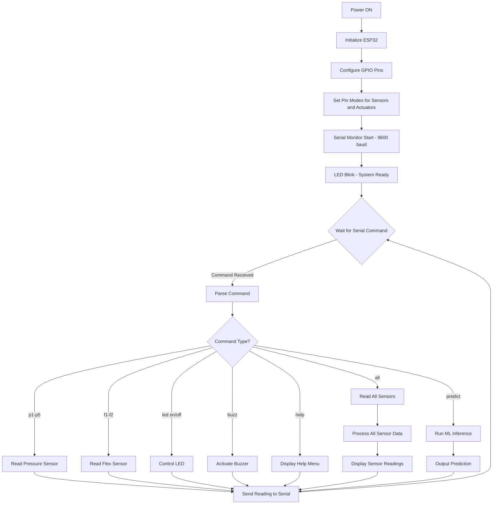

# Smart Chair Posture Monitoring System

An embedded system for real-time sitting posture detection and correction using ESP32, pressure sensors, and flex sensors to promote healthy sitting habits.

## Problem Statement

Prolonged sitting with poor posture leads to chronic back pain, spinal misalignment, and musculoskeletal disorders. Most people are unaware of their sitting posture throughout the day. This project provides a real-time posture monitoring system that detects improper sitting positions and alerts the user immediately, helping prevent long-term health issues.

## System Overview

The Smart Chair is a sensor-based monitoring device built on the ESP32 microcontroller platform. It uses machine learning to classify sitting posture from sensor data. The system focuses on TensorFlow Lite Random Forest inference for posture prediction.

The system operates autonomously without requiring external connectivity, processing all sensor data locally on the ESP32 for immediate feedback.

## Hardware Components

### Microcontroller
**ESP32 38-Pin Development Board**
- Dual-core processor running at 240 MHz
- 520 KB SRAM for sensor data processing
- Multiple GPIO pins with ADC capability for analog sensor input
- Handles all sensor reading, posture evaluation logic, and actuator control
- Powered via USB or external 5V DC supply

### Sensors

**5 Thin Film Pressure Sensors (100kg load capacity each)**
- Located on the chair seat surface in strategic positions
- Measure weight distribution across the seating area
- Analog output proportional to applied pressure
- Connected to ESP32 ADC pins: GPIO 32, 33, 34, 35, 36
- Purpose: Detect if user is sitting unevenly or leaning too far forward/backward

**2 Flex Sensors**
- Mounted vertically on the chair backrest
- Measure the degree of back curvature
- Analog resistance changes with bending
- Connected to ESP32 ADC pins: GPIO 37, 38
- Purpose: Detect slouching or excessive backward lean

**4 Vibration Motors**
- Positioned near pressure sensors on seat surface
- Digital output for haptic feedback
- Connected to ESP32 GPIO pins: 16, 17, 18, 19
- Purpose: Provide tactile feedback for posture correction

### Actuators

**LED Indicator**
- Connected to GPIO 2
- Visual feedback for posture status
- ON = Bad posture detected
- OFF = Good posture

**Buzzer**
- Connected to GPIO 4
- Audio alert for bad posture
- Beeps when improper posture is detected

### Power Supply
- 5V DC via USB cable or external adapter
- Total current consumption: approximately 200-300 mA under normal operation

## Posture Detection Algorithm

The system uses a TensorFlow Lite Micro Random Forest model for posture classification:

### Data Acquisition
1. Read analog values from all 5 pressure sensors (0-4095 range on ESP32 ADC)
2. Read analog values from 2 flex sensors (0-4095 range)
3. Normalize sensor values to 0-1 range for model input

### Machine Learning Model
- **Algorithm**: Random Forest Classifier
- **Framework**: TensorFlow Lite Micro
- **Input Features**: 7 normalized sensor values (5 pressure + 2 flex)
- **Output**: Multi-class posture classification probabilities
- **Classes**: Good Posture, Slouching, Leaning Left, Leaning Right, etc.

### Model Inference
The ESP32 runs the TFLite model locally to predict posture class from sensor data. The predicted class with highest probability is selected as the final posture assessment.

### System Response

The system provides posture prediction results via serial output. The predicted posture class and confidence probability are logged for analysis. No automatic corrective actions are taken - the focus is on the ML prediction algorithm.

## System Flowchart



## Firmware Logic Overview

The firmware is written in Arduino C++ for the ESP32 platform. The main program structure consists of:

### Setup Function
- Initialize serial communication at 9600 baud
- Configure all sensor pins as INPUT
- Configure all actuator pins as OUTPUT
- Perform initial LED blink to indicate system readiness

### Loop Function
The system operates in command-driven mode for testing and debugging:
- Wait for serial input commands
- Parse received command string
- Execute corresponding action based on command
- Return sensor readings or status to serial monitor

### Available Commands
- `p1` to `p5`: Read individual pressure sensors
- `f1` to `f2`: Read individual flex sensors
- `led on` / `led off`: Control LED state
- `buzz`: Test buzzer
- `all`: Read all sensors simultaneously
- `help`: Display command list

This command-based approach allows for component-level testing and validation during development and deployment.

## Machine Learning Integration

The system includes TensorFlow Lite for Microcontrollers to run a Random Forest model for posture classification. This provides more sophisticated posture detection compared to simple threshold-based logic.

### Model Training
1. Collect sensor data from multiple users in good and bad posture positions
2. Label the data (0 = good posture, 1 = bad posture)
3. Train a Random Forest classifier using scikit-learn in Python
4. Convert the trained model to TensorFlow Lite format (.tflite)
5. Embed the model bytes into the ESP32 firmware

### Model Input Features
- 5 pressure sensor readings (normalized 0-1)
- 2 flex sensor readings (normalized 0-1)
- Total: 7 input features

### Model Output
- Multi-class classification with probabilities for each posture type
- Classes: 0=Good Posture, 1=Slouching, 2=Leaning Left, 3=Leaning Right (customizable)
- System selects the class with highest probability

### Firmware Commands
- `predict`: Runs ML inference on current sensor readings and logs the predicted posture class
- `user X`: Select user profile (0-4) for personalized calibration
- `calibrate`: Calibrate sensors for current user (sit in good posture)
- `logs`: Export historical posture data for analysis

### User Profiles and Calibration
- Supports up to 5 user profiles stored in ESP32 SPIFFS
- Each profile includes personalized baseline readings and thresholds
- Calibration process: User sits in correct posture, system records baseline values
- Dynamic thresholds adapt to user's body type and weight

### Data Logging
- Stores last 100 posture predictions with timestamps and sensor data
- Data can be exported via serial for trend analysis
- Enables monitoring posture improvement over time

### Model Replacement
To update the model:
1. Train a new Random Forest model with multi-class labels
2. Convert to .tflite using TensorFlow tools
3. Replace the `model_tflite` array in the code with new model bytes
4. Update `model_tflite_len` with the new length
5. Recompile and upload to ESP32

## Pin Assignments

| Component | GPIO Pin | Type | Notes |
|-----------|----------|------|-------|
| Pressure Sensor 1 | 32 | Analog Input | ADC1 |
| Pressure Sensor 2 | 33 | Analog Input | ADC1 |
| Pressure Sensor 3 | 34 | Analog Input | ADC1, Input-only |
| Pressure Sensor 4 | 35 | Analog Input | ADC1, Input-only |
| Pressure Sensor 5 | 36 | Analog Input | ADC1, Input-only |
| Vibration Motor 1 | 16 | Digital Output | Safe GPIO |
| Vibration Motor 2 | 17 | Digital Output | Safe GPIO |
| Vibration Motor 3 | 18 | Digital Output | Safe GPIO |
| Vibration Motor 4 | 19 | Digital Output | Safe GPIO |
| Flex Sensor 1 | 37 | Analog Input | ADC1, Input-only |
| Flex Sensor 2 | 38 | Analog Input | ADC1, Input-only |
| LED Indicator | 2 | Digital Output | Built-in LED compatible |
| Buzzer | 4 | Digital Output | PWM capable |

All pin assignments avoid conflicts with ESP32 boot pins, flash pins, and WiFi operation.

## Setup and Operation

### Hardware Assembly
1. Mount 5 pressure sensors on chair seat in grid pattern (corners + center)
2. Attach 2 flex sensors vertically on chair backrest (left and right side)
3. Place 4 vibration motors near pressure sensors on seat
4. Connect all sensor outputs to designated ESP32 GPIO pins
5. Connect LED and buzzer to designated output pins
6. Provide 5V power to ESP32 via USB or DC adapter

### Software Installation
1. Install Arduino IDE version 1.8.0 or newer
2. Add ESP32 board support via Board Manager (install "esp32" by Espressif Systems)
3. Clone repository: `git clone https://github.com/qppd/smart-chair.git`
4. Open `source/SmartChair/SmartChair.ino` in Arduino IDE
5. Select board: Tools > Board > ESP32 Dev Module
6. Select correct COM port
7. Upload firmware to ESP32

### Operation
1. Power on the ESP32
2. System initializes and LED blinks once
3. Open Serial Monitor at 9600 baud
4. Use serial commands to test individual components
5. Observe sensor readings and actuator responses
6. Verify posture detection logic by simulating different sitting positions

## Wiring Diagram

Refer to the wiring directory for detailed circuit diagrams:
- `wiring/Wiring.fzz` - Editable Fritzing source file
- `wiring/Wiring.png` - Static circuit diagram image

## Project Structure

```
smart-chair/
├── source/
│   └── SmartChair/
│       └── SmartChair.ino          # Main ESP32 firmware
├── wiring/
│   ├── Wiring.fzz                  # Fritzing circuit design
│   └── Wiring.png                  # Circuit diagram image
├── diagram/                        # Additional system diagrams
├── LICENSE                         # MIT License
└── README.md                       # This documentation
```

## Limitations

1. **Calibration Dependency**: Users must perform initial calibration for accurate personalized thresholds
2. **Limited User Profiles**: Maximum of 5 user profiles supported due to ESP32 storage constraints
3. **Model Accuracy**: ML model performance depends on quality and quantity of training data
4. **Storage Capacity**: Posture logs limited to last 100 entries due to RAM constraints
5. **Real-time Processing**: ML inference adds minor latency compared to threshold-based detection
6. **Power Consumption**: Continuous sensor monitoring and ML processing increases battery drain
7. **Sensor Durability**: Pressure and flex sensors may require periodic recalibration due to wear
8. **Environmental Factors**: Temperature and humidity can affect sensor readings accuracy
9. **Training Data Requirements**: Multi-class posture classification requires diverse labeled training dataset
10. **Model Updates**: Over-the-air model updates not supported; requires firmware recompilation

## Future Development Path

The system now includes TensorFlow Lite for Microcontrollers with Random Forest models for posture classification. Future enhancements could include:

- Over-the-air model updates via WiFi
- Expanded user profile storage with external EEPROM
- Integration with mobile apps for data visualization
- Advanced ML models (CNNs) for more complex posture analysis
- Battery optimization with sleep modes
- Wireless connectivity for remote monitoring

## License

This project is licensed under the MIT License. See LICENSE file for details.

## Author

Created by qppd

## Repository

https://github.com/qppd/smart-chair

  