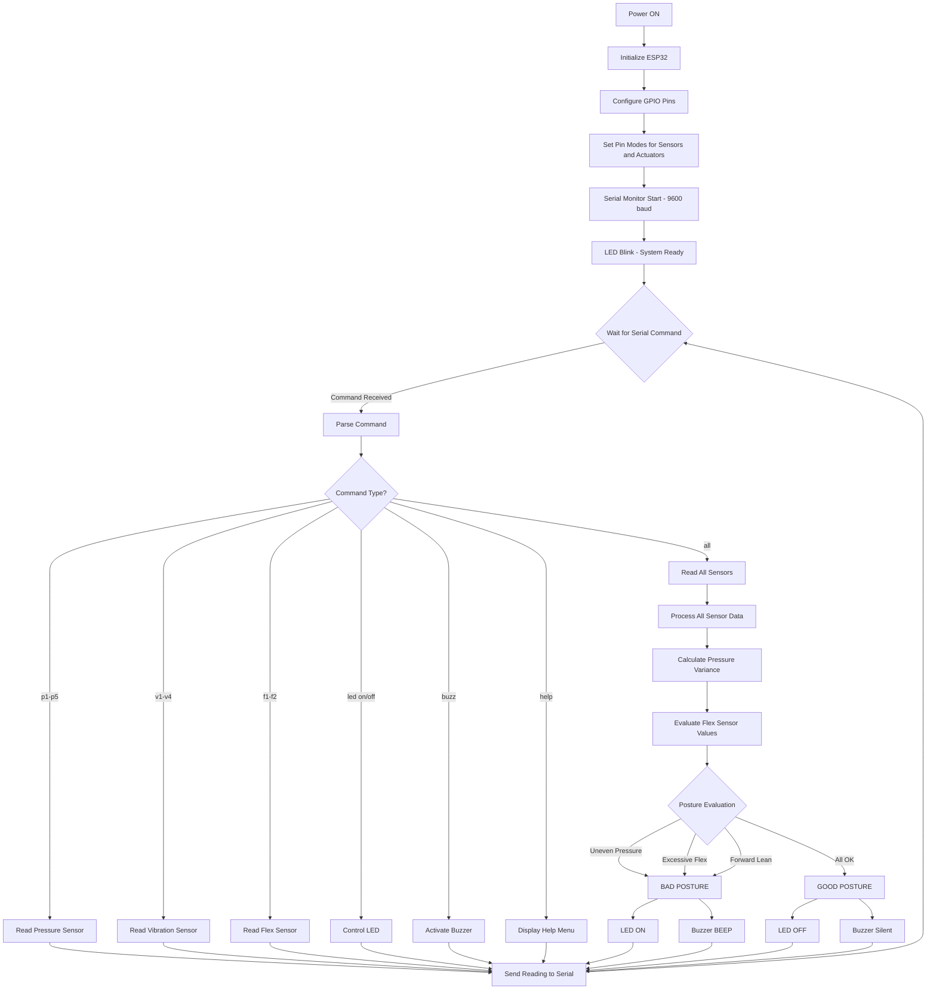

# Smart Chair Posture Monitoring System

An embedded system for real-time sitting posture detection and correction using ESP32, pressure sensors, and flex sensors to promote healthy sitting habits.

## Problem Statement

Prolonged sitting with poor posture leads to chronic back pain, spinal misalignment, and musculoskeletal disorders. Most people are unaware of their sitting posture throughout the day. This project provides a real-time posture monitoring system that detects improper sitting positions and alerts the user immediately, helping prevent long-term health issues.

## System Overview

The Smart Chair is a sensor-based monitoring device built on the ESP32 microcontroller platform. It continuously reads data from multiple sensors embedded in the chair seat and backrest to evaluate the user's sitting posture. When improper posture is detected, the system activates visual and audio alerts to prompt the user to correct their position.

The system operates autonomously without requiring external connectivity, processing all sensor data locally on the ESP32 for immediate feedback.

## Hardware Components

### Microcontroller
**ESP32 38-Pin Development Board**
- Dual-core processor running at 240 MHz
- 520 KB SRAM for sensor data processing
- Multiple GPIO pins with ADC capability for analog sensor input
- Handles all sensor reading, posture evaluation logic, and actuator control
- Powered via USB or external 5V DC supply

### Sensors

**5 Thin Film Pressure Sensors (100kg load capacity each)**
- Located on the chair seat surface in strategic positions
- Measure weight distribution across the seating area
- Analog output proportional to applied pressure
- Connected to ESP32 ADC pins: GPIO 32, 33, 34, 35, 36
- Purpose: Detect if user is sitting unevenly or leaning too far forward/backward

**2 Flex Sensors**
- Mounted vertically on the chair backrest
- Measure the degree of back curvature
- Analog resistance changes with bending
- Connected to ESP32 ADC pins: GPIO 37, 38
- Purpose: Detect slouching or excessive backward lean

**4 Vibration Sensors**
- Positioned near pressure sensors on seat surface
- Digital output (HIGH when vibration detected)
- Connected to ESP32 GPIO pins: 16, 17, 18, 19
- Purpose: Detect excessive movement or fidgeting indicating discomfort

### Actuators

**LED Indicator**
- Connected to GPIO 2
- Visual feedback for posture status
- ON = Bad posture detected
- OFF = Good posture

**Buzzer**
- Connected to GPIO 4
- Audio alert for bad posture
- Beeps when improper posture is detected

### Power Supply
- 5V DC via USB cable or external adapter
- Total current consumption: approximately 200-300 mA under normal operation

## Posture Detection Algorithm

The system uses a threshold-based algorithm to evaluate posture in real-time:

### Data Acquisition
1. Read analog values from all 5 pressure sensors (0-4095 range on ESP32 ADC)
2. Read analog values from 2 flex sensors (0-4095 range)
3. Read digital states from 4 vibration sensors (0 or 1)

### Posture Evaluation Logic

**Good Posture Criteria:**
- Pressure is evenly distributed across all 5 sensors (variance below threshold)
- Both flex sensors show minimal bending (values within acceptable range indicating upright back)
- No excessive vibration detected

**Bad Posture Indicators:**
- Uneven pressure distribution (one or more sensors significantly higher/lower than others)
- Flex sensors indicate slouching (high resistance change)
- One side of the seat has more pressure than the other (lateral imbalance)
- Continuous vibration indicating restlessness

### Decision Logic
```
IF (pressure_variance > THRESHOLD_PRESSURE) THEN
    posture = BAD
ELSE IF (flex_sensor_1 > THRESHOLD_FLEX OR flex_sensor_2 > THRESHOLD_FLEX) THEN
    posture = BAD
ELSE IF (pressure_front_sensors >> pressure_back_sensors) THEN
    posture = BAD (leaning too far forward)
ELSE
    posture = GOOD
END IF
```

### System Response

**If Posture is NOT OK:**
- Turn LED ON
- Activate buzzer (short beep pattern)
- Continue monitoring

**If Posture is OK:**
- Turn LED OFF
- Buzzer remains silent
- Continue monitoring

## System Flowchart



## Firmware Logic Overview

The firmware is written in Arduino C++ for the ESP32 platform. The main program structure consists of:

### Setup Function
- Initialize serial communication at 9600 baud
- Configure all sensor pins as INPUT
- Configure all actuator pins as OUTPUT
- Perform initial LED blink to indicate system readiness

### Loop Function
The system operates in command-driven mode for testing and debugging:
- Wait for serial input commands
- Parse received command string
- Execute corresponding action based on command
- Return sensor readings or status to serial monitor

### Available Commands
- `p1` to `p5`: Read individual pressure sensors
- `v1` to `v4`: Read individual vibration sensors
- `f1` to `f2`: Read individual flex sensors
- `led on` / `led off`: Control LED state
- `buzz`: Test buzzer
- `all`: Read all sensors simultaneously
- `help`: Display command list

This command-based approach allows for component-level testing and validation during development and deployment.

## Pin Assignments

| Component | GPIO Pin | Type | Notes |
|-----------|----------|------|-------|
| Pressure Sensor 1 | 32 | Analog Input | ADC1 |
| Pressure Sensor 2 | 33 | Analog Input | ADC1 |
| Pressure Sensor 3 | 34 | Analog Input | ADC1, Input-only |
| Pressure Sensor 4 | 35 | Analog Input | ADC1, Input-only |
| Pressure Sensor 5 | 36 | Analog Input | ADC1, Input-only |
| Vibration Sensor 1 | 16 | Digital Input | Safe GPIO |
| Vibration Sensor 2 | 17 | Digital Input | Safe GPIO |
| Vibration Sensor 3 | 18 | Digital Input | Safe GPIO |
| Vibration Sensor 4 | 19 | Digital Input | Safe GPIO |
| Flex Sensor 1 | 37 | Analog Input | ADC1, Input-only |
| Flex Sensor 2 | 38 | Analog Input | ADC1, Input-only |
| LED Indicator | 2 | Digital Output | Built-in LED compatible |
| Buzzer | 4 | Digital Output | PWM capable |

All pin assignments avoid conflicts with ESP32 boot pins, flash pins, and WiFi operation.

## Setup and Operation

### Hardware Assembly
1. Mount 5 pressure sensors on chair seat in grid pattern (corners + center)
2. Attach 2 flex sensors vertically on chair backrest (left and right side)
3. Place 4 vibration sensors near pressure sensors on seat
4. Connect all sensor outputs to designated ESP32 GPIO pins
5. Connect LED and buzzer to designated output pins
6. Provide 5V power to ESP32 via USB or DC adapter

### Software Installation
1. Install Arduino IDE version 1.8.0 or newer
2. Add ESP32 board support via Board Manager (install "esp32" by Espressif Systems)
3. Clone repository: `git clone https://github.com/qppd/smart-chair.git`
4. Open `source/SmartChair/SmartChair.ino` in Arduino IDE
5. Select board: Tools > Board > ESP32 Dev Module
6. Select correct COM port
7. Upload firmware to ESP32

### Operation
1. Power on the ESP32
2. System initializes and LED blinks once
3. Open Serial Monitor at 9600 baud
4. Use serial commands to test individual components
5. Observe sensor readings and actuator responses
6. Verify posture detection logic by simulating different sitting positions

## Wiring Diagram

Refer to the wiring directory for detailed circuit diagrams:
- `wiring/Wiring.fzz` - Editable Fritzing source file
- `wiring/Wiring.png` - Static circuit diagram image

## Project Structure

```
smart-chair/
├── source/
│   └── SmartChair/
│       └── SmartChair.ino          # Main ESP32 firmware
├── wiring/
│   ├── Wiring.fzz                  # Fritzing circuit design
│   └── Wiring.png                  # Circuit diagram image
├── diagram/                        # Additional system diagrams
├── LICENSE                         # MIT License
└── README.md                       # This documentation
```

## Limitations

1. **No Calibration Mechanism**: Sensor thresholds are hardcoded and not adjustable per user body type or weight
2. **Single User Profile**: System does not adapt to different users with varying body dimensions
3. **Limited Posture States**: Only binary classification (good/bad) without specific posture type identification
4. **No Data Logging**: System does not store historical posture data for trend analysis
5. **Wired Power Only**: Requires constant USB or DC power connection, not battery operated
6. **Manual Testing Mode**: Current firmware requires serial commands for operation, not autonomous real-time monitoring
7. **Fixed Thresholds**: Pressure and flex thresholds must be determined experimentally and hardcoded
8. **No Wireless Communication**: System operates standalone without WiFi or Bluetooth connectivity
9. **Sensor Placement Sensitivity**: Performance depends on accurate sensor positioning during installation
10. **Environmental Factors**: Pressure sensors may drift with temperature changes or long-term use

## Future Development Path

While the current system operates on threshold-based logic, the hardware and ESP32 platform support integration of machine learning models using TensorFlow Lite for Microcontrollers. This would enable more sophisticated posture classification based on trained models rather than fixed thresholds.

## License

This project is licensed under the MIT License. See LICENSE file for details.

## Author

Created by qppd

## Repository

https://github.com/qppd/smart-chair

  