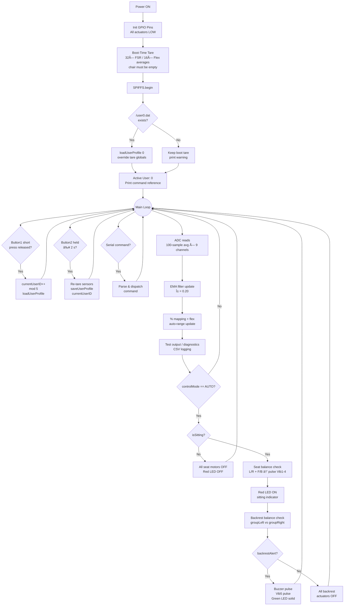

# Smart Chair Posture Monitoring System

A real-time embedded system for sitting posture detection and haptic feedback using an ESP32, multimodal sensor fusion, threshold-based posture analysis, and a persistent multi-user calibration system — with no machine learning required.

[](https://opensource.org/licenses/MIT)
[](https://github.com/qppd/smart-chair/stargazers)
[](https://github.com/qppd/smart-chair/network)
[](https://github.com/qppd/smart-chair/issues)

---

## Table of Contents

1. [System Overview](#system-overview)
2. [Key Features](#key-features)
3. [Hardware Architecture](#hardware-architecture)
   - [Component Specifications](#component-specifications)
   - [Pin Mapping Table](#pin-mapping-table)
   - [Power Requirements](#power-requirements)
4. [Wiring Overview](#wiring-overview)
5. [Software Architecture](#software-architecture)
   - [Firmware Overview](#firmware-overview)
   - [Main Loop Flow](#main-loop-flow)
   - [Signal Processing Pipeline](#signal-processing-pipeline)
   - [Posture Detection Logic](#posture-detection-logic)
   - [Control Modes](#control-modes)
   - [Data Structures](#data-structures)
   - [File Structure](#file-structure)
6. [User Profile System](#user-profile-system)
   - [Profile Storage Format](#profile-storage-format)
   - [Profile Lifecycle](#profile-lifecycle)
   - [Boot Behavior](#boot-behavior)
7. [Button Controls](#button-controls)
8. [System Flow](#system-flow)
9. [Serial Command Interface](#serial-command-interface)
10. [Calibration System](#calibration-system)
11. [Data Logging and Export](#data-logging-and-export)
12. [Performance and Resource Usage](#performance-and-resource-usage)
13. [Limitations](#limitations)
14. [Future Improvements](#future-improvements)
15. [Installation and Setup](#installation-and-setup)
    - [Hardware Assembly](#hardware-assembly)
    - [Arduino IDE Setup](#arduino-ide-setup)
    - [ESP32 Configuration](#esp32-configuration)
16. [Project Structure](#project-structure)
17. [License](#license)
18. [Contributing Guidelines](#contributing-guidelines)
19. [Author and Credits](#author-and-credits)

---

## System Overview

The Smart Chair Posture Monitoring System is a fully self-contained embedded IoT device built on the ESP32 microcontroller. It continuously monitors sitting posture using five Force-Sensitive Resistors (FSRs) distributed across the seat surface and four flex sensors mounted on the backrest. All sensor data is filtered, threshold-analysed, and mapped to real-time haptic, visual, and auditory actuator feedback — entirely on-device, with no cloud connectivity and no machine learning.

> **Note:** This is V2 of the Smart Chair project. This version replaces the earlier HX711 load-cell and TensorFlow Lite approach with a simpler, more reliable FSR + threshold-based system that is easier to calibrate, maintain, and extend.

**Posture analysis** is performed by comparing filtered ADC readings against per-user tare baselines captured at calibration time. When imbalance exceeds configurable thresholds, the corresponding vibration motor pulses to cue the user to correct their posture. The backrest flex sensors independently detect lateral lean and activate a buzzer and fifth vibration motor when the asymmetry crosses a defined limit.

A **multi-user profile system** (up to 5 users) stores individual sensor baselines in SPIFFS flash memory, enabling personalized calibration for shared environments. Profiles can be managed via the Serial command interface or directly from the two physical buttons mounted on the chair.

A **dataset logging mode** streams labeled, timestamped CSV rows over Serial for offline analysis or training data collection, compatible with the bundled Python logger.

All processing occurs locally on the ESP32 without any external network or compute dependency.

---

## Key Features

- **Real-Time Posture Monitoring**: Continuous, non-blocking acquisition and threshold analysis of all nine sensor channels at every loop iteration.
- **No Machine Learning**: Posture detection is fully deterministic — based on configurable ADC thresholds and per-sensor tare deltas. No model training, no inference latency, no tensor arena.
- **Multimodal Sensor Fusion**: Five FSR seat pressure sensors and four backrest flex sensors provide comprehensive postural coverage.
- **EMA Noise Filtering**: Single-pole IIR (exponential moving average, α = 0.20) applied to all nine sensor channels, seeded on first pass to prevent boot transients.
- **Multi-Sample ADC Averaging**: Each reading averages 100 samples (16–32 for tare operations) with 200 µs inter-sample settling — minimising EMI and ADC non-linearity effects.
- **Multi-User Profiles**: Up to 5 independent user profiles stored as binary files in SPIFFS (`/user0.dat` … `/user4.dat`). Each profile holds per-user FSR tare, flex tare, and adaptive flex range values.
- **Physical Button Control**: BUTTON1 cycles through user profiles (short press); BUTTON2 performs a full calibration and saves it for the active user (long press ≥ 2 s). Both are non-blocking and use the existing debounce system.
- **Adaptive Flex Auto-Ranging**: Each flex sensor tracks its deepest observed bend since the last tare. Once the span exceeds the noise floor (8 ADC counts), flex percentages are auto-scaled to [0, 100 %] for consistent diagnostics across sensor sensitivities.
- **Pulsed Haptic Feedback**: Vibration motors and the buzzer pulse ON/OFF (200 ms on / 300 ms off) rather than latching, avoiding fatigue and improving detectability.
- **Three Control Modes**: AUTO (posture-driven feedback), MANUAL (serial-commanded), TEST (timed motor / sensor test, others suppressed).
- **Dataset Logging**: Timestamped CSV output prefixed with `DATA:` for easy capture and filtering. A Python logger script (`source/py/dataset_logger/logger.py`) automates collection.
- **Full Serial Command Interface**: Interactive command parser (115200 baud) covering actuator control, sensor testing, re-tare, logging, and user profile management.
- **Fully Offline Operation**: No Wi-Fi, no Bluetooth, no external dependencies at runtime.
- **Open Source**: MIT-licensed codebase.

---

## Hardware Architecture

### Component Specifications

#### Microcontroller

**ESP32 38-Pin Development Board**
- **Processor**: Dual-core Xtensa LX6, up to 240 MHz
- **Memory**: 520 KB SRAM, 4 MB flash (typical)
- **ADC**: 12-bit resolution (0–4095), ADC1 channels preferred (GPIO 32–39); ADC2 (GPIO 25–27) safe when WiFi is unused
- **GPIO**: 34 programmable pins; input-only GPIOs (34, 35, 36, 39) used for flex sensors
- **Storage**: SPIFFS filesystem for persistent user profile storage
- **Connectivity**: USB-to-UART (CP2102 or CH340) for programming and serial data
- **Power**: 5 V via USB; onboard 3.3 V LDO for logic and sensor dividers

#### Seat Sensors — 5× Force-Sensitive Resistors (FSR)

| Position | GPIO | ADC Channel | Feedback Actuator |
|----------|------|-------------|-------------------|
| Right    | 32   | ADC1_CH4    | Vibration Motor 1 (GPIO 19) |
| Left     | 27   | ADC2_CH7    | Vibration Motor 2 (GPIO 18) |
| Front    | 26   | ADC2_CH9    | Vibration Motor 3 (GPIO 13) |
| Back     | 33   | ADC1_CH5    | Vibration Motor 4 (GPIO 14) |
| Middle   | 25   | ADC2_CH8    | Red LED           (GPIO 12) |

- **Type**: Thick-film piezoresistive (e.g., Interlink FSR 402 or equivalent)
- **Resistance range**: ~1 MΩ (unloaded) → ~200 Ω (full load ~10 kg)
- **Interface**: Voltage divider — 3.3 V → 10 kΩ pull-up → GPIO → FSR → GND
- **Noise reduction**: 100-sample averaged ADC read + EMA (α = 0.20)
- **Calibration**: Boot-time tare (32-sample average, chair empty); restorable via `retare` command or BUTTON2 long press

#### Backrest Sensors — 4× Flex Sensors

| Sensor | GPIO | ADC Channel | Group |
|--------|------|-------------|-------|
| Flex 1 | 34   | ADC1_CH6    | Left  |
| Flex 2 | 35   | ADC1_CH7    | Right |
| Flex 3 | 36   | ADC1_CH0    | Left  |
| Flex 4 | 39   | ADC1_CH3    | Right |

- **Type**: Variable resistor (resistance increases with bending)
- **Interface**: Same 10 kΩ voltage divider as FSRs; GPIOs 34/35/36/39 are input-only (no boot conflict)
- **Left group**: Flex 1 + Flex 3; **Right group**: Flex 2 + Flex 4
- **Balance logic**: Sum the absolute ADC deltas per group; if |Left − Right| ≥ `FLEX_BALANCE_THRESHOLD` (15 counts) → buzzer + Vib5 + Green LED alert
- **Noise floor**: Deltas < 8 ADC counts are treated as electrical noise and zeroed

#### Actuators

| Component         | GPIO | Type           | Driven By                              |
|-------------------|------|----------------|----------------------------------------|
| Vibration Motor 1 | 19   | Digital output | FSR Right imbalance                    |
| Vibration Motor 2 | 18   | Digital output | FSR Left imbalance                     |
| Vibration Motor 3 | 13   | Digital output | FSR Front imbalance                    |
| Vibration Motor 4 | 14   | Digital output | FSR Back imbalance                     |
| Vibration Motor 5 | 5    | Digital output | Backrest lateral imbalance             |
| Buzzer            | 23   | Digital output | Backrest lateral imbalance (pulsed)    |
| Red LED           | 12   | Digital output | Middle FSR — sitting indicator (solid) |
| Green LED         | 17   | Digital output | Backrest alert (solid)                 |

- **Vibration motors**: Coin-type ERM motors. Use transistor driver (e.g. 2N2222) if motor current exceeds safe GPIO limit (~40 mA).
- **Pulsing**: Buzzer and vibration motors in AUTO mode pulse 200 ms ON / 300 ms OFF using a shared `millis()` modulo clock.

#### User Input — 2× Tactile Buttons

| Button  | GPIO | Pull Configuration | Function                              |
|---------|------|--------------------|---------------------------------------|
| BUTTON1 | 21   | INPUT_PULLUP (active LOW) | Short press → next user profile |
| BUTTON2 | 22   | INPUT_PULLUP (active LOW) | Long press (≥ 2 s) → calibrate & save |

---

### Pin Mapping Table

> **V2 Hardware Note:** HX711 load-cell amplifiers from V1 have been fully removed. GPIO 32/33 are now ADC1 FSR inputs. GPIO 25/26/27 are ADC2 FSR inputs (safe when WiFi is unused).

| Component              | GPIO | Direction  | Notes                                          |
|------------------------|------|------------|------------------------------------------------|
| Flex Sensor 1          | 34   | Input only | ADC1_CH6 — input-only pin, backrest left       |
| Flex Sensor 2          | 35   | Input only | ADC1_CH7 — input-only pin, backrest right      |
| Flex Sensor 3          | 36   | Input only | ADC1_CH0 (SVP) — backrest left                 |
| Flex Sensor 4          | 39   | Input only | ADC1_CH3 (VN) — backrest right                 |
| FSR Right              | 32   | Input only | ADC1_CH4 — seat right                          |
| FSR Left               | 27   | Input only | ADC2_CH7 — seat left                           |
| FSR Front              | 26   | Input only | ADC2_CH9 — seat front                          |
| FSR Middle             | 25   | Input only | ADC2_CH8 — seat center / sitting indicator     |
| FSR Back               | 33   | Input only | ADC1_CH5 — seat back                           |
| Vibration Motor 1      | 19   | Output     | FSR Right feedback                             |
| Vibration Motor 2      | 18   | Output     | FSR Left feedback                              |
| Vibration Motor 3      | 13   | Output     | FSR Front feedback                             |
| Vibration Motor 4      | 14   | Output     | FSR Back feedback                              |
| Vibration Motor 5      | 5    | Output     | Backrest lateral imbalance feedback            |
| Buzzer                 | 23   | Output     | Backrest alert — pulsed                        |
| Red LED                | 12   | Output     | Middle FSR sitting indicator — solid           |
| Green LED              | 17   | Output     | Backrest alert — solid                         |
| BUTTON1 (User Switch)  | 21   | Input (PULLUP) | Short press cycles user profile            |
| BUTTON2 (Calibrate)    | 22   | Input (PULLUP) | Long press calibrates current user         |

**Voltage Divider Circuit (FSR and Flex sensors):**
```
VCC (3.3 V)
    │
 [R_pull = 10 kΩ]
    │
    ├──── GPIO (ADC input)
    │
 [Sensor] (FSR or Flex – variable resistance)
    │
   GND
```
As the sensor resistance decreases under load/bend, the ADC voltage — and therefore the 12-bit reading (0–4095) — decreases. Load and bend are computed as the **delta from the tare baseline**, so each sensor self-calibrates regardless of its individual offset.

---

### Power Requirements

**Power Budget Analysis:**

| Component                        | Current (approx.) |
|----------------------------------|-------------------|
| ESP32 active (dual-core)         | ~150 mA           |
| Sensor voltage dividers (passive)| ~1–2 mA total     |
| Red LED                          | ~20 mA            |
| Green LED                        | ~20 mA            |
| Buzzer (active)                  | ~30 mA            |
| Single vibration motor           | ~80 mA            |
| Five vibration motors (all ON)   | ~400 mA           |
| **Worst-case total**             | **~625 mA**       |

**Recommended supply**: 5 V, 1.5 A USB power adapter or external DC adapter for safe operating margin.

---

## Wiring Overview

The wiring diagram is provided in the `wiring/` directory:
- **Wiring.fzz**: Fritzing project file with complete breadboard layout and circuit schematic.

### Circuit Principles

#### Pressure and Flex Sensors (Analog Input)

Both FSR and flex sensors are variable resistors interfaced via a 10 kΩ voltage divider to the ESP32 ADC. As resistance drops (more force or more bend), the ADC reading **decreases** from the tare value. The firmware computes load and bend as the positive delta from the tare:

```
fsrPct[i]  = (fsrTare[i]  − emaFsr[i])  / fsrTare[i]  × 100   (0 % = no load, 100 % = full load)
flexDelta[i] = flexTare[i] − emaFlex[i]                          (0 = straight, positive = bent)
```

#### Vibration Motors (Digital Output)

Each motor is controlled via a GPIO digital output. Because individual motor current (~80 mA) can exceed safe GPIO source current, use a transistor driver (e.g., 2N2222 NPN):

```
GPIO → [1 kΩ base resistor] → BJT base
                                   │ collector → Motor (+) → VCC (5 V)
                                   │ emitter  → GND
```

#### LEDs and Buzzer (Digital Output)

LEDs are driven directly from GPIOs with appropriate current-limiting resistors (~220 Ω for 3.3 V logic). The buzzer is connected directly to its GPIO pin.

---

### Hardware Block Diagram


```mermaid
graph TD
    A[5V Power Supply] --> B[ESP32 38-Pin Dev Board]

    B -->|GPIO 34/35/36/39 ADC1| D1[Flex Sensors 1–4\nBackrest]
    B -->|GPIO 32/33 ADC1| F1[FSR Right / Back\nSeat]
    B -->|GPIO 25/26/27 ADC2| F2[FSR Front / Middle / Left\nSeat]

    B -->|GPIO 19 OUT| V1[Vib Motor 1 – Right]
    B -->|GPIO 18 OUT| V2[Vib Motor 2 – Left]
    B -->|GPIO 13 OUT| V3[Vib Motor 3 – Front]
    B -->|GPIO 14 OUT| V4[Vib Motor 4 – Back]
    B -->|GPIO 5  OUT| V5[Vib Motor 5 – Backrest]

    B -->|GPIO 12 OUT| RL[Red LED – Sitting Indicator]
    B -->|GPIO 17 OUT| GL[Green LED – Backrest Alert]
    B -->|GPIO 23 OUT| BZ[Buzzer – Backrest Alert]

    B -->|GPIO 21 IN PULLUP| BTN1[BUTTON1 – User Switch]
    B -->|GPIO 22 IN PULLUP| BTN2[BUTTON2 – Calibrate]

    B -->|USB UART 115200| SER[Serial Interface\nCommands / Data]

    SPIFFS[SPIFFS Flash\n/user0.dat … /user4.dat] -.->|User Profiles| B

    style B fill:#4A90E2,stroke:#333,stroke-width:3px,color:#fff
    style SPIFFS fill:#F5A623,stroke:#333,stroke-width:2px
```

---

## Software Architecture

### Firmware Overview

The firmware is written in Arduino C++ as a single `.ino` file with clearly separated functional sections. There are no RTOS tasks; everything runs in a cooperative single-threaded loop using `millis()` for non-blocking timing.

**Libraries required:**
- `Arduino.h` — ESP32 Arduino core
- `SPIFFS.h` — Filesystem for persistent user profile storage (included in ESP32 Arduino core)

No TensorFlow, HX711, or ML libraries are required.

---

### Main Loop Flow

Each `loop()` iteration executes the following stages in order:

```
1. Button debounce + press-timing evaluation
   ├── BUTTON1 release (short press) → cycle user profile
   └── BUTTON2 hold (≥ 2 s)        → calibrate & save profile

2. Serial command parser
   └── Parse and dispatch one command per iteration (if available)

3. Averaged ADC reads
   ├── 4× flex sensors  (100-sample average each)
   └── 5× FSR sensors   (100-sample average each)

4. EMA filter update
   └── emaFlex[4], emaFsr[5] — seeded on first pass

5. Percentage mapping
   ├── fsrPct[i]   = (fsrTare[i] − emaFsr[i])  / fsrTare[i]  × 100  [0–100 %]
   └── flexPct[i]  = auto-ranged delta / observed span × 100           [0–100 %]

6. Flex adaptive range update
   └── flexRangeMin[i] tracks deepest bend observed since last tare

7. Sensor test output (if test mode active — 10 s window each)

8. Diagnostic serial prints
   ├── Flex %: every 1 s
   └── FSR % + sitting status: every 2 s

9. Dataset logging (if enabled)
   └── DATA:<csv row> at configured interval

10. Vibration motor test auto-off (after 10 s)

11. Posture detection + actuator feedback (AUTO mode only)
    ├── Sitting gate: avgSeatLoad ≥ 25 % → someone is sitting
    ├── L/R seat balance → Vib1 or Vib2 (pulsed)
    ├── F/B seat balance → Vib3 or Vib4 (pulsed)
    ├── Middle FSR       → Red LED (solid)
    └── Backrest lateral imbalance → Buzzer + Vib5 + Green LED

delay(50)
```

---

### Signal Processing Pipeline

#### Multi-Sample ADC Averaging

```cpp
int averagedRead(uint8_t pin, uint8_t samples = ADC_SAMPLES) {
    // ADC_SAMPLES = 100; 200 µs inter-sample delay
    // Returns integer mean of all samples
}
```

Averaging spreads and cancels high-frequency ADC noise and EMI spikes. Tare operations use 16–32 samples for speed; live readings use 100 samples.

#### Exponential Moving Average (EMA)

```
y[n] = α · x[n] + (1 − α) · y[n−1]      α = 0.20
```

Applied to all nine channels. A smaller α produces a smoother signal at the cost of slower response. The EMA is seeded with the first raw reading on boot to avoid the startup transient that would otherwise occur as the filter converges from zero.

#### Tare-Relative Percentage Mapping

Sensors are inverted (more load/bend = lower ADC value). The percentage formula produces:
- **0 %** at the tare (unloaded/straight) baseline
- **100 %** at maximum expected load/bend

```
fsrPct[i] = constrain((fsrTare[i] − emaFsr[i]) / fsrTare[i] × 100, 0, 100)
```

#### Adaptive Flex Auto-Ranging

Each flex sensor tracks its deepest observed bend (`flexRangeMin[i]`) since the last tare:

```
span = flexTare[i] − flexRangeMin[i]

flexPct[i] = (span > FLEX_NOISE_FLOOR)
             ? flexDelta[i] / span × 100          // auto-ranged (reliable)
             : flexDelta[i] / flexTare[i] × 100   // fallback before range is learned
```

This self-calibrates the 0–100 % scale to the physical bend range of each sensor, compensating for manufacturing variance in flex sensor stiffness.

---

### Posture Detection Logic

#### Sitting Detection

All seat feedback is gated on confirmed occupancy to prevent false alerts when the chair is empty:

```
avgSeatLoad = mean(fsrPct[0..4])
isSitting   = avgSeatLoad ≥ SITTING_THRESHOLD (25 %)
```

#### Seat Balance (L/R and F/B)

When sitting is confirmed, paired FSR percentages are compared:

| Condition                        | Alert          | Threshold |
|----------------------------------|----------------|-----------|
| FSR_Right % − FSR_Left % > 20 % | Vibrate Vib1   | 20 %      |
| FSR_Left % − FSR_Right % > 20 % | Vibrate Vib2   | 20 %      |
| FSR_Front % − FSR_Back % > 20 % | Vibrate Vib3   | 20 %      |
| FSR_Back % − FSR_Front % > 20 % | Vibrate Vib4   | 20 %      |

Motors pulse at 200 ms ON / 300 ms OFF to provide rhythmic tactile cues without latching.

#### Backrest Lateral Balance

```
groupLeft  = flexDelta[0] + flexDelta[2]   // Flex1 + Flex3
groupRight = flexDelta[1] + flexDelta[3]   // Flex2 + Flex4

backrestAlert = |groupLeft − groupRight| ≥ FLEX_BALANCE_THRESHOLD (15 counts)
```

When alert fires: Buzzer pulses, Green LED latches ON, Vib5 pulses (in AUTO mode).

Symmetric full-back pressure does not trigger this alert because both groups increase equally — only lateral asymmetry does.

#### Noise Floor Deadband

Flex deltas below 8 ADC counts are zeroed:
```
flexDelta[i] = (flexTare[i] − emaFlex[i] ≥ 8) ? delta : 0
```

This suppresses false alerts from electrical noise and minor ADC drift.

---

### Control Modes

| Mode   | Description | Actuator Writes |
|--------|-------------|-----------------|
| `AUTO`   | Posture detection drives all actuators automatically | Posture logic controls all pins |
| `MANUAL` | Serial commands control individual motors/actuators; posture loop suppressed | Only explicit commands write pins |
| `TEST`   | Timed 10-second motor or sensor test; posture loop suppressed | Only the test target is active; others forced OFF |

Mode transitions:
- `vib auto` → AUTO
- `vib <n> on/off` or `vib all on/off` → MANUAL
- `test vibration <n>` → TEST (auto-returns to AUTO after 10 s)

---

### Data Structures

#### UserProfile

Stores all per-user calibration data in a compact binary struct:

```cpp
struct UserProfile {
    float fsrTare[5];       // Boot-time no-load FSR baselines
    float flexTare[4];      // Boot-time straight-backrest flex baselines
    float flexRangeMin[4];  // Running minimum per flex sensor (deepest bend seen)
};
// sizeof(UserProfile) = (5 + 4 + 4) × 4 bytes = 52 bytes per user
```

The struct is written and read directly as a binary blob — no JSON serialisation, no string parsing, minimal flash wear.

**Global state:**

```cpp
uint8_t currentUserID = 0;    // Active user (0–4); default = 0

// Globals used by ALL posture and percentage logic:
float fsrTare[5];             // Current user's FSR baselines
float flexTare[4];            // Current user's flex baselines
float flexRangeMin[4];        // Current user's adaptive flex minima
```

When a profile is loaded, its values are copied directly into these globals — all existing posture and percentage calculations use them without modification.

---

### File Structure

```
SmartChair.ino
├── Includes
│   ├── Arduino.h
│   └── SPIFFS.h
├── Pin Definitions (actuators, buttons, flex, FSR)
├── Filtering Configuration (ADC_SAMPLES, EMA_ALPHA)
├── Threshold Configuration (SITTING_THRESHOLD, BALANCE_THRESHOLD, …)
├── Beep/Pulse Configuration (BEEP_ON_MS, BEEP_OFF_MS)
├── EMA Filter State (emaFsr[], emaFlex[], emaInit)
├── Flex Adaptive Range State (flexRangeMin[])
├── Boot Tare Globals (fsrTare[], flexTare[])
├── Logging State (loggingEnabled, logInterval, logLabel)
├── Timing State (lastSensorPrintTime, lastFsrPrintTime)
├── Flex / FSR Test Mode Flags
├── Vibration Motor Test State (vibTestActive, vibTestMask, vibTestStart)
├── Vibration Pin Array (vibrationPins[5])
├── Control Mode Enum (AUTO / MANUAL / TEST)
├── User Profile System
│   ├── MAX_USERS (5)
│   ├── struct UserProfile
│   └── currentUserID
├── Button Debounce State (btn1Raw, btn1Stable, btn1ChangeAt, …)
├── Button Press-Timing State (btn1PressAt, btn2PressAt, btn2CalibDone)
├── averagedRead()
├── applyEma()
├── handleVibrationCommand()
├── profilePath() / profileExists() / saveUserProfile() / loadUserProfile()
├── setup()
│   ├── Pin initialisation
│   ├── Boot-time tare (32 FSR samples, 16 flex samples)
│   ├── SPIFFS mount
│   ├── Auto-load User 0 profile (if exists)
│   └── Serial command reference print
└── loop()
    ├── Button debounce + action dispatch
    ├── Serial command handler
    ├── ADC reads + EMA update
    ├── Percentage mapping + flex auto-range
    ├── Sensor test output
    ├── Diagnostic prints
    ├── Dataset CSV logging
    ├── Vibration test auto-off
    └── Posture detection + actuator feedback
```

---

## User Profile System

The User Profile system enables up to 5 independent users to share a single chair, each with their own sensor calibration baselines. This is essential because FSR and flex readings are highly dependent on body weight, height, and sitting style — a single fixed calibration cannot serve multiple users reliably.

### Profile Storage Format

Each profile is stored as a raw binary file in the ESP32 SPIFFS filesystem:

| File       | Contents                                |
|------------|-----------------------------------------|
| `/user0.dat` | `UserProfile` struct for User 0 (52 bytes) |
| `/user1.dat` | `UserProfile` struct for User 1        |
| …          | …                                       |
| `/user4.dat` | `UserProfile` struct for User 4        |

The struct is written with a single `File.write()` call and read back with `File.read()`, with size verification to detect truncated files. No JSON or text encoding is used — binary format minimises write size, parse overhead, and flash wear.

### Profile Lifecycle

```
1. BOOT
   └── Hardware tare captured (32× FSR, 16× flex samples, chair empty)
       └── Attempt auto-load User 0 from /user0.dat
           ├── EXISTS → override boot tare with saved values → "User 0 profile loaded."
           └── NOT EXISTS → keep boot tare → "No saved profile for User 0 – using boot tare."

2. SELECT USER  (Serial: "user X"  |  Button1 short press)
   ├── currentUserID = X
   ├── loadUserProfile(X)
   │   ├── EXISTS → copy fsrTare[], flexTare[], flexRangeMin[] into globals
   │   │           → "Profile loaded."  →  emaInit = false (re-seed EMA)
   │   └── NOT EXISTS → globals unchanged
   │                   → "User X not calibrated."
   └── Print: "Active User: X"

3. CALIBRATE    (Serial: "calibrate"  |  Button2 long press ≥ 2 s)
   ├── Re-sample all sensors (32× FSR, 16× flex, chair must be empty)
   ├── Update fsrTare[], flexTare[], flexRangeMin[] for currentUserID
   ├── saveUserProfile(currentUserID)  →  write /userX.dat
   └── Print: "Calibration complete." / "Calibration saved."

4. RETARE       (Serial: "retare")
   ├── Re-sample (same as calibrate)
   ├── saveUserProfile(currentUserID)
   └── Print: "Re-tare complete."

5. SAVE USER    (Serial: "save user")
   └── saveUserProfile(currentUserID) using current globals

6. LIST USERS   (Serial: "list users")
   └── Print exists/empty + [active] marker for each ID 0–4
```

### Boot Behavior

On every power-on:
1. Actuator pins are set LOW (all off).
2. A hardware tare is always taken from live sensors (no-load baseline). This ensures the system works even if SPIFFS is empty or corrupt.
3. SPIFFS is mounted (`SPIFFS.begin(true)` — auto-formats on first use).
4. If `/user0.dat` exists and is valid (correct size), its tare values override the live-captured tare.
5. The active user defaults to User 0.

This design guarantees the chair is always operational even if no profiles have been saved, while also applying a user's personal calibration automatically on boot.

---

## Button Controls

The two tactile buttons provide physical control over the User Profile system without requiring a serial terminal. Both are debounced using the existing 50 ms debounce state machine and use `millis()`-based timing — no `delay()` calls, fully non-blocking.

### BUTTON1 — User Profile Switch (Short Press)

| Attribute         | Value |
|-------------------|-------|
| GPIO              | 21 (INPUT_PULLUP, active LOW) |
| Trigger condition | Release after press duration < 500 ms |
| Action            | Cycle `currentUserID` → (0 → 1 → 2 → 3 → 4 → 0) |

**Behavior on press:**
1. On stable LOW: record `btn1PressAt = millis()`.
2. On stable HIGH (release): compute `pressDuration = millis() − btn1PressAt`.
3. If `pressDuration < 500 ms`:
   - Increment `currentUserID` modulo 5.
   - Call `loadUserProfile(currentUserID)`.
   - If found: print `"Active User: X"` + `"Profile loaded."` + reseed EMA.
   - If not found: print `"Active User: X"` + `"User X not calibrated."`.

### BUTTON2 — Calibrate Current User (Long Press)

| Attribute         | Value |
|-------------------|-------|
| GPIO              | 22 (INPUT_PULLUP, active LOW) |
| Trigger condition | Button held ≥ 2000 ms |
| Action            | Full sensor re-tare + save profile for `currentUserID` |

**Behavior while held:**
1. On stable LOW: record `btn2PressAt = millis()`; clear `btn2CalibDone` flag.
2. Every loop: if button is still LOW and `millis() − btn2PressAt ≥ 2000 ms` and `!btn2CalibDone`:
   - Set `btn2CalibDone = true` (prevents re-firing during the same press).
   - Print: `"Calibrating User X (button)..."`.
   - Capture 32× FSR averages → `fsrTare[5]`.
   - Capture 16× flex averages → `flexTare[4]`, reset `flexRangeMin[4]`.
   - Call `saveUserProfile(currentUserID)`.
   - Print: `"Calibration saved."`
   - Reseed EMA (`emaInit = false`).
3. On release: `btn2CalibDone` is cleared (ready for next press).

> **Important**: Ensure the chair is empty (no person, no objects) when triggering Button2 calibration. Tare values captured with load present will produce incorrect posture readings.

---

## System Flow


```mermaid
flowchart TD
    A[Power ON] --> B[Init GPIO Pins\nAll actuators LOW]
    B --> C[Boot-Time Tare\n32× FSR / 16× Flex averages\nchair must be empty]
    C --> D[SPIFFS.begin]
    D --> E{/user0.dat\nexists?}
    E -->|Yes| F[loadUserProfile 0\noverride tare globals]
    E -->|No| G[Keep boot tare\nprint warning]
    F --> H[Active User: 0\nPrint command reference]
    G --> H
    H --> I((Main Loop))

    I --> J{Button1 short\npress released?}
    J -->|Yes| K[currentUserID++\nmod 5\nloadUserProfile]
    K --> I

    I --> L{Button2 held\n≥ 2 s?}
    L -->|Yes| M[Re-tare sensors\nsaveUserProfile\ncurrentUserID]
    M --> I

    I --> N{Serial command?}
    N -->|Yes| O[Parse & dispatch\ncommand]
    O --> I

    I --> P[ADC reads\n100-sample avg × 9 channels]
    P --> Q[EMA filter update\nα = 0.20]
    Q --> R[% mapping + flex\nauto-range update]
    R --> S[Test output / diagnostics\nCSV logging]
    S --> T{controlMode == AUTO?}
    T -->|No| I
    T -->|Yes| U{isSitting?}
    U -->|No| V[All seat motors OFF\nRed LED OFF]
    U -->|Yes| W[Seat balance check\n L/R + F/B → pulse Vib1-4]
    W --> X[Red LED ON\nsitting indicator]
    X --> Y[Backrest balance check\ngroupLeft vs groupRight]
    Y --> Z{backrestAlert?}
    Z -->|Yes| AA[Buzzer pulse\nVib5 pulse\nGreen LED solid]
    Z -->|No| AB[All backrest\nactuators OFF]
    AA --> I
    AB --> I
    V --> I
```

---

## Serial Command Interface

Serial connection: **115200 baud, 8N1**. Commands are plain ASCII strings terminated by `\n` (newline). Send via Arduino IDE Serial Monitor, PuTTY, or any terminal emulator.

### Actuator Control

| Command | Description | Mode change |
|---------|-------------|-------------|
| `buzzer on` / `buzzer off` | Toggle buzzer directly | — |
| `red led on` / `red led off` | Toggle red LED (GPIO 12) | — |
| `green led on` / `green led off` | Toggle green LED (GPIO 17) | — |
| `vib <1-5> on` / `vib <1-5> off` | Control individual vibration motor by number | → MANUAL |
| `vib all on` / `vib all off` | Control all five motors simultaneously | → MANUAL |
| `vib auto` | Return to automatic posture-driven control | → AUTO |

### Calibration

| Command | Description |
|---------|-------------|
| `retare` | Re-capture boot-time no-load baselines for all sensors. Updates `fsrTare[]`, `flexTare[]`, `flexRangeMin[]` for the **current user** and saves to SPIFFS. Chair must be empty. |

### Sensor Tests (10-second timed windows)

| Command | Description |
|---------|-------------|
| `test flex1` … `test flex4` | Print filtered flex ADC value every 200 ms for 10 s |
| `test fsr right` | Print filtered FSR-RIGHT ADC value every 200 ms for 10 s |
| `test fsr left` | Print filtered FSR-LEFT ADC value every 200 ms for 10 s |
| `test fsr front` | Print filtered FSR-FRONT ADC value every 200 ms for 10 s |
| `test fsr back` | Print filtered FSR-BACK ADC value every 200 ms for 10 s |
| `test fsr mid` | Print filtered FSR-MID ADC value every 200 ms for 10 s |
| `test vibration <1-5>` | Run a specific motor for 10 s; all others forced OFF → TEST mode |
| `test vibration all` | Run all five motors for 10 s → TEST mode |

### Dataset Logging

| Command | Description |
|---------|-------------|
| `log start` | Enable CSV logging. Prints `DATA_HEADER:` row then `DATA:` rows at the configured interval. |
| `log stop` | Disable CSV logging. |
| `log rate <ms>` | Set logging interval in milliseconds (minimum 50 ms, default 100 ms). |
| `label <name>` | Set the `label` field value appended to every `DATA:` row (max 47 chars, default `unlabeled`). |

### User Profile Management

| Command | Description |
|---------|-------------|
| `user 0` … `user 4` | Switch the active user. Loads profile from SPIFFS if it exists; otherwise prints `"User X not calibrated."` Always prints `"Active User: X"`. Reseeds EMA. |
| `calibrate` | Full re-tare for the current user (chair must be empty). Captures 32× FSR and 16× flex averages, updates globals, saves to `/userX.dat`. |
| `save user` | Explicitly save the current global tare values to the active user's SPIFFS file without re-reading sensors. |
| `list users` | Print the existence status of all five profile slots and which is currently active. |

**Example `list users` output:**
```
── User Profiles ──
  User 0: saved  [active]
  User 1: saved
  User 2: empty
  User 3: empty
  User 4: empty
────────────────────
```

---

## Calibration System

### Tare vs User Calibration

The system uses two related but distinct calibration concepts:

| Concept | When | Scope | Persistence |
|---------|------|-------|-------------|
| **Boot tare** | Every power-on | Always applied (system cannot start without it) | RAM only (volatile) |
| **User calibration** | On demand (`calibrate`, `retare`, Button2 long press) | Per-user — stored in SPIFFS | Persistent across power cycles |

### How Tare Values Are Used

After calibration:
- `fsrTare[i]` holds the ADC reading for FSR i with the chair empty.
- `flexTare[i]` holds the ADC reading for Flex i with the backrest straight.
- `flexRangeMin[i]` is seeded to `flexTare[i]` and decrements over time as the sensor is bent.

All posture percentages are computed as **deltas from these baselines**, not as absolute ADC values. This means:
- The system is immune to sensor manufacturing variance.
- It is immune to changes in ambient temperature and supply voltage that shift the ADC baseline.
- Different users can use the same chair without reconfiguring thresholds.

### Calibration Procedure

1. Ensure the chair is completely empty.
2. Send `calibrate` via serial (or hold BUTTON2 for ≥ 2 seconds).
3. The firmware captures:
   - 32-sample averaged readings for each FSR → `fsrTare[0..4]`
   - 16-sample averaged readings for each flex sensor → `flexTare[0..3]`
   - Resets `flexRangeMin[i] = flexTare[i]`
4. Values are saved to `/userX.dat` for the active user.
5. The EMA filter is reseeded.

To switch between users' calibrations without re-measuring, use `user X` (serial) or BUTTON1 (short press).

---

## Data Logging and Export

The logging system streams labeled CSV rows over the Serial port. A companion Python script (`source/py/dataset_logger/logger.py`) automates capture, filtering, and file management.

### Activating Logging

```
label sitting_upright    ← Set a descriptive label for this session
log rate 200             ← Set interval to 200 ms (5 Hz)
log start                ← Begin logging
...sit in position...
log stop                 ← End logging
```

### CSV Format

On `log start`, the firmware emits a header row (filtered by the Python logger on the `DATA_HEADER:` prefix):

```
DATA_HEADER:timestamp_ms,flex1,flex2,flex3,flex4,fsr_right,fsr_left,fsr_front,fsr_back,fsr_mid,total_fsr,front_back_ratio,left_right_ratio,label
```

Each data row is prefixed with `DATA:` so the logger can discard all diagnostic print lines:

```
DATA:12345,2100,2080,2110,2090,1900,1850,1750,1820,2000,7320,0.9615,0.9737,sitting_upright
```

### Column Definitions

| Column | Type | Description |
|--------|------|-------------|
| `timestamp_ms` | uint32 | `millis()` value at capture time |
| `flex1`…`flex4` | float | EMA-filtered ADC readings for Flex 1–4 |
| `fsr_right`…`fsr_mid` | float | EMA-filtered ADC readings for each FSR |
| `total_fsr` | float | Sum of right + left + front + back FSR values (middle excluded) |
| `front_back_ratio` | float | `fsrFront / fsrBack` (0 if back ≤ 1) |
| `left_right_ratio` | float | `fsrLeft / fsrRight` (0 if right ≤ 1) |
| `label` | string | User-set label for supervised dataset annotation |

### Python Logger

```bash
cd source/py/dataset_logger
pip install -r requirements.txt
python logger.py
```

The logger filters serial output — only lines beginning with `DATA:` are written to the output CSV; lines beginning with `DATA_HEADER:` set the column names; all other lines are ignored.

---

## Performance and Resource Usage

### Computational Performance

| Operation | Duration (approx.) |
|-----------|-------------------|
| Single `averagedRead()` (100 samples, 200 µs each) | ~21 ms |
| Nine channels total (5 FSR + 4 flex per loop) | ~189 ms |
| EMA update (9 channels) | < 1 µs |
| Posture threshold evaluation | < 1 µs |
| `delay(50)` at loop end | 50 ms |
| **Total loop period (approx.)** | **~240 ms (≈ 4 Hz)** |

The bottleneck is intentional — 100-sample averaging greatly improves signal quality at the cost of throughput. For faster response, reduce `ADC_SAMPLES` (e.g., to 10 for ~25 ms per channel). For smoother signals, increase it or reduce `EMA_ALPHA`.

### Memory Usage

| Region | Usage (approx.) |
|--------|----------------|
| Flash (firmware, no ML) | ~100–150 KB |
| SRAM (globals, EMA state, stack) | ~20–40 KB |
| SPIFFS per user profile | 52 bytes |
| SPIFFS filesystem overhead | ~10–20 KB |
| **Total SPIFFS for 5 profiles** | **< 1 KB data + overhead** |

No dynamic memory allocation (`new`, `malloc`) is used anywhere in the firmware. All arrays are fixed-size globals.

---

## Limitations

1. **Maximum 5 User Profiles**: Hard-coded at compile time (`MAX_USERS = 5`). Increasing requires only changing this constant and re-flashing.
2. **Manual User Switching**: Users must switch profiles physically (BUTTON1) or via serial (`user X`). There is no automatic user detection or identification.
3. **No Wireless Connectivity**: The system does not support Wi-Fi or Bluetooth. Data export is Serial-only.
4. **Chair Must Be Empty at Calibration**: If `calibrate` or `retare` is triggered with a person on the chair, all subsequent posture readings will be incorrect until re-calibrated correctly.
5. **Non-Persistent Flexrange**: `flexRangeMin[]` is reset to `flexTare[]` on each calibration. The adaptive range must be re-learned after every tare (takes a few bending cycles).
6. **ADC2 Conflict with WiFi**: GPIOs 25, 26, 27 (FSR Left, Front, Middle) are ADC2 pins. If WiFi is ever enabled in future firmware versions, these sensors will read incorrectly. Use ADC1 pins for a WiFi-capable revision.
7. **No Absolute Pressure Measurement**: FSR readings are relative (% from tare), not calibrated in Pascals or Newtons. The system detects asymmetry and relative loading, not absolute weight.
8. **Single-Threaded Execution**: The long ADC averaging (100 samples × 9 channels ≈ 189 ms) means serial commands and button presses are serviced at ~4 Hz. For more responsive UI, reduce `ADC_SAMPLES`.

---

## Future Improvements

1. **Automatic User Identification**: Use a short-press fingerprint (e.g., unique pressure signature at sit-down) to auto-select the closest matching profile.
2. **Wireless Data Export**: Add WiFi/BLE support (note: requires migrating ADC2 FSR pins to ADC1) for remote monitoring and OTA firmware updates.
3. **Real-Time Clock (RTC)**: Replace `millis()` with absolute ISO 8601 timestamps in logged data.
4. **Web Dashboard**: Companion web interface (served from ESP32 or external host) for real-time sensor visualisation, profile management, and data download.
5. **Persistent Flex Range**: Save `flexRangeMin[]` to SPIFFS periodically so the adaptive range survives power cycles.
6. **Expanded Profile Metadata**: Add user name string, weight, height to the profile struct for richer multi-user management.
7. **Configurable Thresholds per User**: Store `BALANCE_THRESHOLD`, `SITTING_THRESHOLD`, etc. inside the `UserProfile` struct for individual sensitivity tuning.
8. **IMU Integration**: Add an accelerometer/gyroscope (e.g., MPU-6050) to detect chair tilt and user micro-movements for richer posture context.
9. **Energy Efficiency**: Implement ESP32 light-sleep between sensor reads for battery-powered deployments.
10. **PCB Design**: Replace the breadboard prototype with a custom PCB for reliability and miniaturisation.

---

## Installation and Setup

### Hardware Assembly

1. **Procure Components:**
   - ESP32 38-pin development board (e.g., ESP32-DevKitC or equivalent)
   - 5× force-sensitive resistor (Interlink FSR 402 or similar)
   - 4× flex sensor (4.5" or 2.2" depending on backrest size)
   - 5× coin-type ERM vibration motor
   - 1× piezoelectric buzzer (active or passive)
   - 1× red LED + 1× green LED
   - 2× tactile push button (normally-open)
   - 10× 10 kΩ resistors (voltage dividers for all 9 sensors)
   - 2× 220 Ω resistors (LED current limiting)
   - 5× NPN transistors (2N2222 or similar, for vibration motor drivers)
   - 5× 1 kΩ resistors (transistor base resistors)
   - Breadboard and jumper wires
   - 5 V, 1.5 A DC power supply

2. **Wire Sensors (Voltage Divider):**
   ```
   3.3 V → [10 kΩ] → GPIO → [Sensor] → GND
   ```
   Repeat for all 5 FSRs (GPIOs 25, 26, 27, 32, 33) and all 4 flex sensors (GPIOs 34, 35, 36, 39).

3. **Wire Vibration Motors (Transistor Driver):**
   ```
   GPIO 19/18/13/14/5 → [1 kΩ] → BJT base
                                    collector → Motor(+) → 5 V
                                    emitter  → GND
   ```

4. **Wire LEDs:**
   - Red LED: GPIO 12 → [220 Ω] → LED anode → LED cathode → GND
   - Green LED: GPIO 17 → [220 Ω] → LED anode → LED cathode → GND

5. **Wire Buzzer:** GPIO 23 → buzzer(+) → buzzer(−) → GND

6. **Wire Buttons:**
   - BUTTON1: GPIO 21 ↔ GND (firmware uses `INPUT_PULLUP`; no external resistor needed)
   - BUTTON2: GPIO 22 ↔ GND

7. **Sensor Placement:**
   - FSRs: distribute under seat foam at Right, Left, Front, Back, and Middle positions.
   - Flex sensors: mount vertically on backrest — Flex 1 & 3 on the left side, Flex 2 & 4 on the right side.
   - Vibration motors: embed in seat foam near each corresponding FSR.
   - Buttons: mount on armrest or chair frame for easy access.

**Reference:** See [wiring/Wiring.fzz](wiring/Wiring.fzz) for the full Fritzing schematic.

---

### Arduino IDE Setup

1. **Install Arduino IDE** (version 1.8.x or 2.x): [https://www.arduino.cc/en/software](https://www.arduino.cc/en/software)

2. **Install ESP32 Board Support:**
   - `File → Preferences → Additional Board Manager URLs`:
     ```
     https://raw.githubusercontent.com/espressif/arduino-esp32/gh-pages/package_esp32_index.json
     ```
   - `Tools → Board → Boards Manager` → search **esp32** → install **"esp32 by Espressif Systems"** (v2.0.x or later)

3. **No additional libraries required.** `SPIFFS.h` is bundled with the ESP32 Arduino core. There is no TensorFlow, HX711, or ML library dependency.

---

### ESP32 Configuration

1. **Open sketch:** `source/esp32/SmartChair/SmartChair.ino`

2. **Select board:** `Tools → Board → ESP32 Arduino → ESP32 Dev Module`

3. **Select port:** `Tools → Port → <your COM port>`

4. **Configure partition scheme:**
   `Tools → Partition Scheme → Default 4MB with spiffs` (ensures SPIFFS partition is available for user profiles)

5. **Upload:** Click Upload (→). Compilation takes 30–60 seconds on first build.

6. **Open Serial Monitor:** `Tools → Serial Monitor` at **115200 baud**.

7. **Verify boot output:**
   ```
   Capturing tare – keep chair empty...
     FSR1 tare: 3982
     ...
   Tare complete. Chair is ready.
   No saved profile for User 0 – using boot tare.
   Active User: 0

   ── Serial Command Reference ─────────────────────────────────
     Actuators : buzzer on/off | red led on/off | green led on/off
                 vib <1-5> on/off | vib all on/off | vib auto
     Tare      : retare
     Profiles  : user <0-4> | calibrate | save user | list users
     ...
   ```

8. **First-time calibration (with chair empty):**
   ```
   calibrate
   ```
   Then sit in the chair and verify flex and FSR diagnostics print sensible percentages.

---

## Project Structure

```
smart-chair/
├── LICENSE                          # MIT License
├── README.md                        # This file
├── diagram/                         # System diagrams
├── ml/                              # Dataset storage (for offline analysis)
│   └── dataset/
├── model/                           # 3D CAD models (Fusion 360)
│   ├── Smart_Chair.f3d
│   └── Smart_Chair_Case.f3d
├── source/
│   ├── esp32/
│   │   └── SmartChair/
│   │       └── SmartChair.ino       # Main ESP32 firmware (Arduino C++)
│   └── py/
│       └── dataset_logger/
│           ├── logger.py            # Python serial data capture script
│           └── requirements.txt     # Python dependencies
└── wiring/
    └── Wiring.fzz                   # Fritzing circuit schematic
```

---

## 3D Model & Design Documentation

The chair hardware was designed in Autodesk Fusion 360. The source files are located in the `model/` directory:

| File | Description |
|------|-------------|
| `model/Smart_Chair.f3d` | Full chair assembly with sensor mount points |
| `model/Smart_Chair_Case.f3d` | ESP32 enclosure / electronics case |

Fusion 360 (free for personal use) is required to open `.f3d` files. Export to `.step` or `.stl` for use with other CAD tools or 3D printing.

---

## License

This project is licensed under the **MIT License**.

```
MIT License

Copyright (c) 2025 qppd

Permission is hereby granted, free of charge, to any person obtaining a copy
of this software and associated documentation files (the "Software"), to deal
in the Software without restriction, including without limitation the rights
to use, copy, modify, merge, publish, distribute, sublicense, and/or sell
copies of the Software, and to permit persons to whom the Software is
furnished to do so, subject to the following conditions:

The above copyright notice and this permission notice shall be included in all
copies or substantial portions of the Software.

THE SOFTWARE IS PROVIDED "AS IS", WITHOUT WARRANTY OF ANY KIND, EXPRESS OR
IMPLIED, INCLUDING BUT NOT LIMITED TO THE WARRANTIES OF MERCHANTABILITY,
FITNESS FOR A PARTICULAR PURPOSE AND NONINFRINGEMENT. IN NO EVENT SHALL THE
AUTHORS OR COPYRIGHT HOLDERS BE LIABLE FOR ANY CLAIM, DAMAGES OR OTHER
LIABILITY, WHETHER IN AN ACTION OF CONTRACT, TORT OR OTHERWISE, ARISING FROM,
OUT OF OR IN CONNECTION WITH THE SOFTWARE OR THE USE OR OTHER DEALINGS IN THE
SOFTWARE.
```

See [LICENSE](LICENSE) for the full text.

---

## Contributing Guidelines

Contributions are welcome. This project benefits from community involvement in hardware testing, firmware improvements, and documentation.

### How to Contribute

1. **Fork** the repository on GitHub.
2. **Clone** your fork: `git clone https://github.com/your-username/smart-chair.git`
3. **Create a branch**: `git checkout -b feature/your-feature-name`
4. **Make changes** and test thoroughly on real hardware if possible.
5. **Commit** with clear messages: `git commit -m "Add: per-user flex threshold tuning"`
6. **Push**: `git push origin feature/your-feature-name`
7. **Open a Pull Request** against the `main` branch with a clear description.

### Contribution Areas

- **Hardware**: Improved sensor mounting, alternative sensors, PCB design.
- **Firmware**: Optimizations, new features (Wi-Fi reporting, OTA updates, BLE), bug fixes.
- **Dataset / Calibration**: More robust tare procedures, multi-point calibration methods.
- **Documentation**: Tutorials, build guides, translated READMEs.
- **Testing**: Real-world validation across different chair types and user body types.

### Code Style

- Follow standard Arduino C++ conventions.
- Use descriptive variable and function names (existing naming convention: `camelCase`).
- Comment non-obvious logic; avoid redundant comments on self-evident code.
- Do not introduce external library dependencies without discussion.

### Reporting Issues

Open an issue at [https://github.com/qppd/smart-chair/issues](https://github.com/qppd/smart-chair/issues) with:
- A clear title and description.
- Steps to reproduce (including serial output if applicable).
- Hardware configuration (board revision, sensor model).

---

## Author and Credits

**Author**: qppd  
**GitHub**: [https://github.com/qppd](https://github.com/qppd)  
**Repository**: [https://github.com/qppd/smart-chair](https://github.com/qppd/smart-chair)

### Acknowledgments

- **Espressif Systems** — ESP32 hardware platform and Arduino core.
- **Arduino Community** — Open-source toolchain and library ecosystem.
- **Open Source Contributors** — SPIFFS, analogRead averaging patterns, and embedded systems resources that informed this implementation.

---

*For questions, bug reports, or collaboration inquiries, please open an issue on the GitHub repository.*
